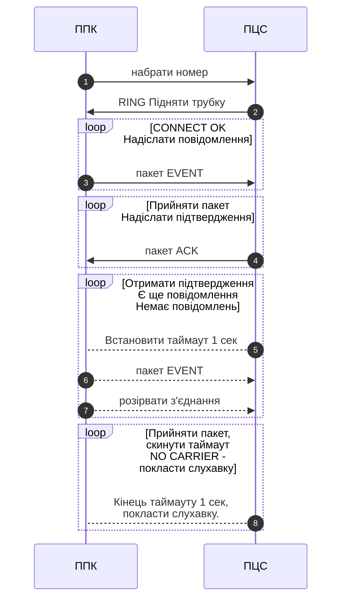
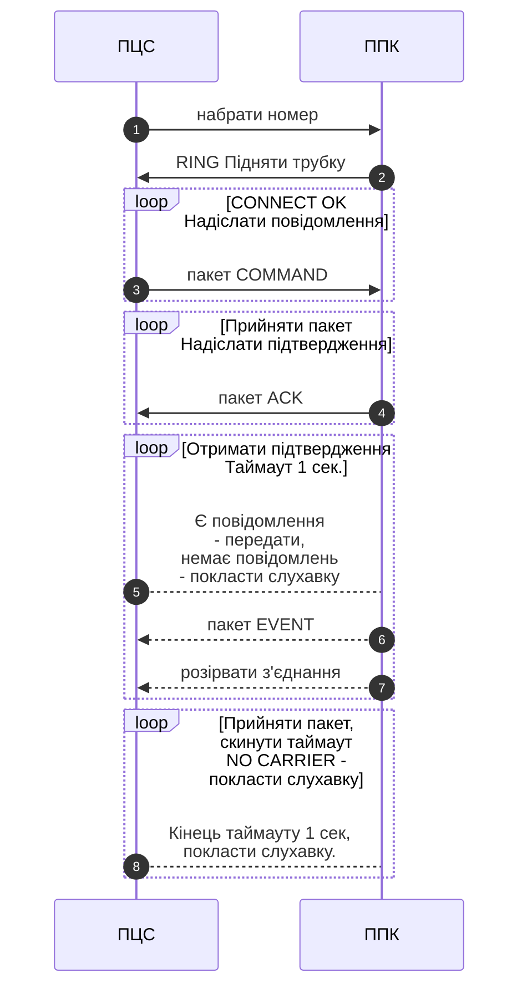
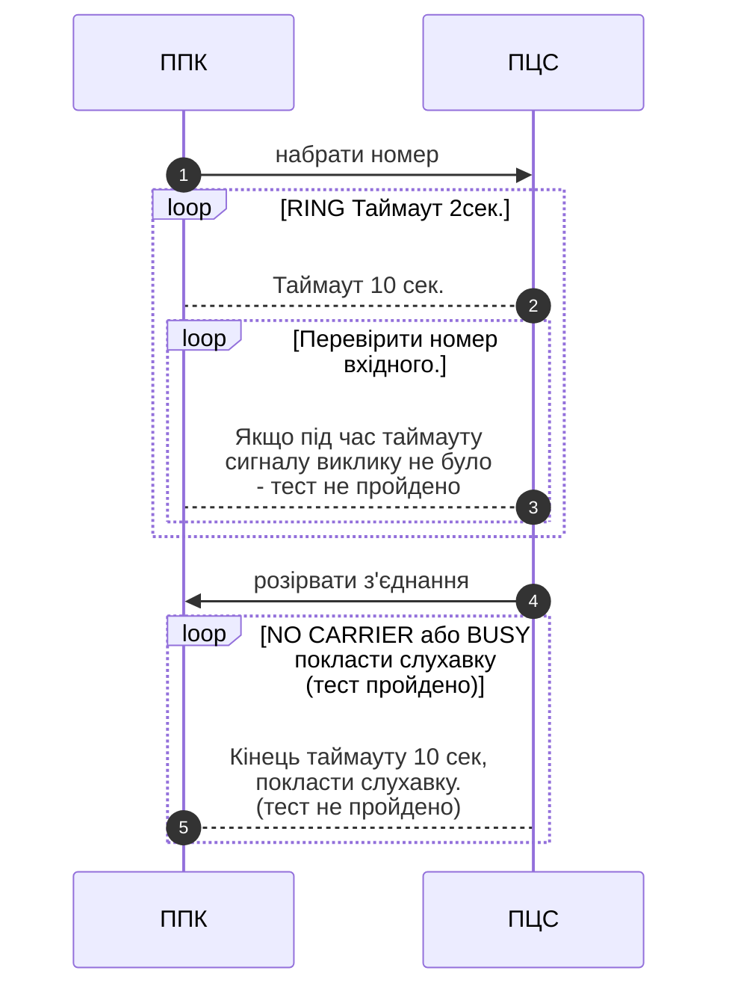
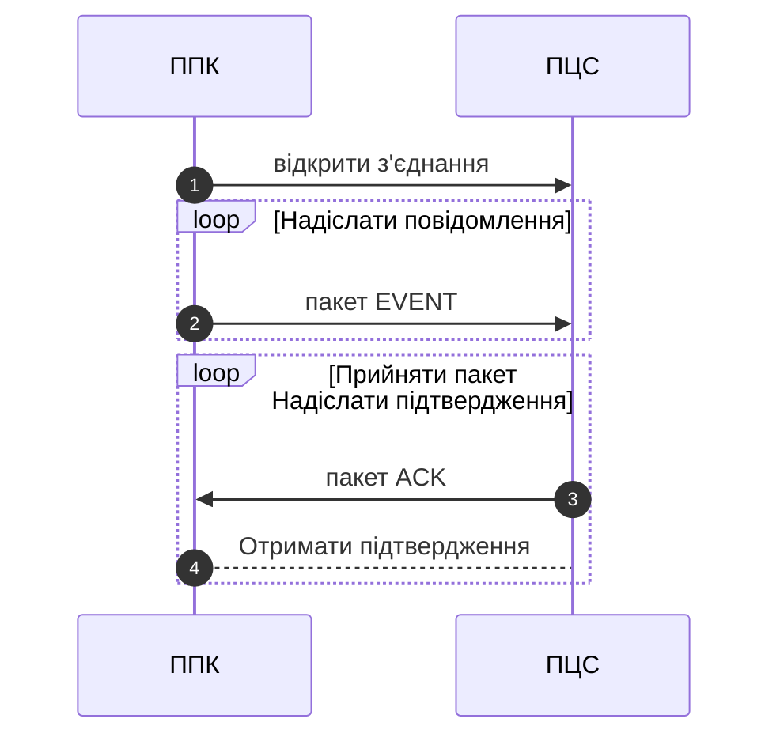
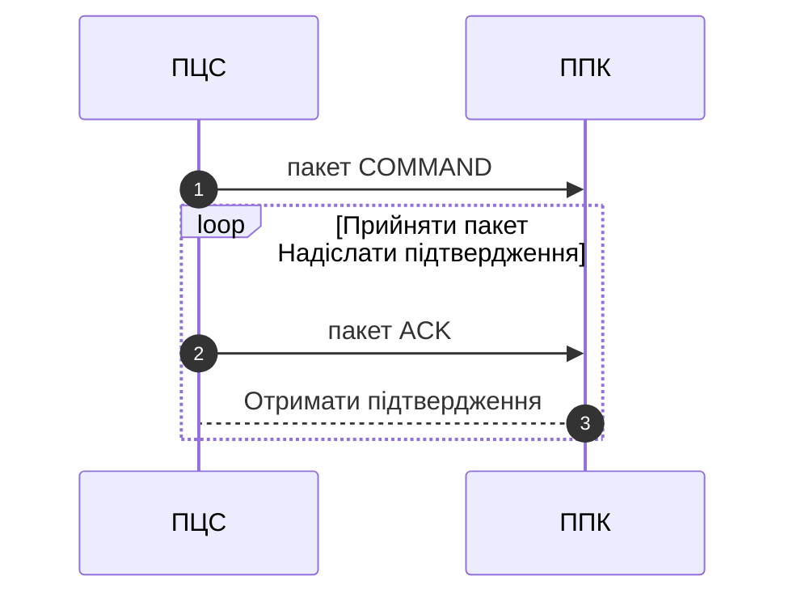

<!-- ПРОТОКОЛ "Nova" Ver.3 -->

# ПРОТОКОЛ "Nova" Ver.3
**1\. Опис протоколу.  
1.1  Загальні відомості**

**1.1.1 Сеанс зв'язку в CSD з ініціативи ППК (зміна стану, тести зв'язку)**  
`{CSD не реалізовано!}`

**1.1.2 Сеанс зв'язку в CSD з ініціативи ПЦС (команди)**  
`{CSD не реалізовано!}`

**1.1.3 Безоплатний тест зв'язку в голосовому каналі**  
`{CSD не реалізовано!}`

**1.1.4 Сеанс зв'язку в GPRS або Ethernet з ініціативи ППК (зміна стану, тести зв'язку)**  

**1.1.5 Сеанс зв'язку в GPRS або Ethernet з ініціативи ПЦС (команди)**  

<!-- Структура пакета «Nova». -->

## 1.2 Структура пакета «Nova».

1.2.1 Загальний формат пакетів від ПЦС або ППК відрізняються тільки значенням поля SYNH.  
1.2.2 Поля DAT мають змінну довжину, залежно від типу пакета.  
1.2.3 Максимальна довжина пакета (від SYNH до CRC8) - 509 байтів.  

<!-- Таблиця 1.1 -->

<b>Таблиця 1.1</b> - Структура пакетів «Nova»

|Поле|Довжина, байт|Опис|
|---|---|---|
|SYNH|1|0x9С - напрямок від ППК на ПЦС   0xС9- напрямок від ПЦС до ППК|
|SER_ID|4|Заводський серійний номер|
|PROT_VER|1|Версія протоколу|
|CRYPT_TYPE|1|Метод шифрування:   0x00 - без шифрування;   0x01 - DES;   0x02 - AES128;   0x03 - AES128 з використанням статичного ключа;|
|PATH|1|Канал зв'язку, формат **0xAB**:   **A** – фізичний канал: 0 - SIM1, 1 - SIM2, 2 - Ethernet, 3 - WiFi;   **B** – номер сокета ПЦС (порядок перебору під час спроби передавання);|
|PACK_ID|1|Ідентифікатор пакета (0х01h-0хFFh). Лічильник номера поточного пакета, формується приладом. Може бути використаний для видалення підтверджених повідомлень.|
|PCN_ID|1|Ідентифікатор пакета (0х01h-0хFFh). Лічильник номера поточного пакета, формується пультом, згідно з пунктом 4|
|LEN|2|0x0A ... 0x1F6 - довжина блоку даних DAT0... DATxxx (без урахування CRC8).|
|DAT0.. DAT499|0.. 499|Блок даних, до якого можуть входити будь-які дані, як-от повідомлення, дані журналу, налаштування, ідентифікатори версії ПЗ тощо.|
|CRC8|1|Поліном Dallas/Maxim: X8+X5+X4+1 (0x31/0x8C/0x98). Застосовується виключно для блоку даних|

*Примітки:*
1. *Хоча транспортний рівень TCP або UDP має свою контрольну суму CRC, CRC8 у пакеті "Nova" використовується для перевірки правильності розшифрування даних.*
2. *У пакетах усі поля довжиною більше одного байта формуються у форматі **Little-endian**: BYTEL ... BYTEH.*
3. *Загальна довжина блоку PACK_ID ... CRC8 пакета після шифрування не повинна бути більше 504 байтів.*

**1.3 Шифрування**  

**Доповнення блоків**  

**Шифрування пакета**

<!-- Ідентифікатор пакета -->
**1.4 Ідентифікатор пакета**
	
Формування ідентифікатора пакета здійснюється таким чином.
  - За генерацію **PCN_ID** відповідає **ТІЛЬКИ** ПЦС.
  - За генерацію **PACK_ID** відповідає **ТІЛЬКИ** об'єктовий пристрій.
  - Об'єктовий пристрій (ППК, ПСО) під час формування події генерує **PACK_ID**. Значення **PCN_ID** береться з попереднього сеансу зв'язку з пультом, для кожного сокета ПЦС окремо (значення **B** у полі  PATH Табл.1.1) . Якщо попереднього сеансу зв'язку не було (перше увімкнення), **PCN_ID** від приладу встановлюється рівним 0 (або, якщо прилад зберігає значення в енергонезалежній пам'яті, береться з енергонезалежної пам'яті).
  - У разі штатного знеструмлення (розряд батареї внаслідок відсутності основного живлення) об'єктовий пристрій має зберегти **PACK_ID** в енергонезалежній пам'яті перед відключенням від батареї, якщо це передбачено конструкцією.
  - Під час увімкнення після повного знеструмлення об'єктовий пристрій починає сеанс із **PACK_ID** = 1.

<!-- Процедура обробки вхідних пакетів пультом -->
**1.5  Процедура обробки вхідних пакетів пультом.**

Якщо пульт не зміг розшифрувати вхідний пакет (DEV_ID вхідного пакета в базі є), пульт формує в журнал повідомлення **"Розбіжність ключа шифрування"**.
	
Якщо пульт розшифрував вхідний пакет коректно:
  1. `Нормальний обмін`. Якщо в прийнятому пакеті **PCN_ID** збігається **зі збереженим на** пульті значенням, пульт **<u>обробляє пакет</u>**, генерує і зберігає новий **PCN_ID** (1-255), і надсилає його в підтвердженні (**ACK**). Виняток - див. `"Повтор пакета"`.
  2. `Збій ідентифікатора пакета.` Якщо **PCN_ID** не збігається, необхідно, **<u>не обробляючи прийнятий пакет</u>**, надіслати команду **"Запит на повтор пакета"** з новим **PCN_ID**. Якщо відповідь від об'єктового пристрою повернута з **PCN_ID**, що відповідає запиту, прийнятий пакет відправляється в обробку. В іншому випадку, процедура може бути повторена багаторазово (певну кількість разів, або до закінчення часу тесту з приладом, якщо він не великий). Починаючи з Rev.12 протоколу введено команду [0x0А22 - Запит ідентифікації пристрою.](#a5) У разі розбіжності **PCN_ID** можна надіслати команду 0х0А22 для перевірки достовірності пристрою (пристрій має повернути для звірки прихований ідентифікатор, який має бути збережено (збережено) на пульті під час налаштування об'єкта).  
  Детальний опис алгоритму опрацювання ідентифікатора пакета і визначення підміни пультом (з урахуванням різних версій ПЗ), показано в **Додатку А.**  
  3. `Повтор пакета.` Пульт має зберігати останнє отримане значення **PACK_ID** від пристрою.  Якщо в прийнятому пакеті **PACK_ID** збігається зі збереженим раніше значенням (з попереднього приймання), це повтор пакета. На повтор пакета потрібно відповісти, але без зміни **PCN_ID**.

<!-- Можливість автоматичного підстроювання інтервалу контролю тестових повідомлень пультом -->
<b id="a4">1.6  Можливість автоматичного підстроювання інтервалу контролю тестових повідомлень пультом.</b>

Починаючи з REV.12 протоколу, прилад у пакеті **TEST_EVENT** ("Повідомлення "Тест") передає значення інтервалу тесту **TEST_TIME** (у секундах), що записано в налаштуваннях приладу.  
Це значення може бути використано пультом для автоматичного налаштування інтервалу часу для контролю зв'язку з приладом. Рекомендоване значення інтервалу часу, який використовується для контролю зв'язку, - **TEST_TIME * 3**.  
**Для визначення підтримки протоколом параметра TEST_TIME (визначення старих версій), потрібно використовувати довжину пакета TEST_EVENT, для версій протоколу без підтримки TEST_TIME вона менша.**
	
**Рекомендації щодо реалізації функції на пульті.**

Зміна раніше збереженого значення TEST_TIME у базах пульта має відбуватися щоразу після отримання таких команд: **0х0303, 0х0304, 0х0301, 0х0307.**

<!-- ПОВІДОМЛЕННЯ ВІД ППК (EVENTS) -->
## 2 ПОВІДОМЛЕННЯ ВІД ППК (EVENTS)

У таблицях наведено тільки формат блоку даних DAT0... DAT499 пакета протоколу "Nova" ([Таблиця 1.1](#table1-1)).

<!-- АВТОМАТИЧНО СФОРМОВАНІ -->
## 2.1 АВТОМАТИЧНО СФОРМОВАНІ

<!-- IDT_EVENT -->

Пакет <b>IDT_EVENT</b> — Дані про прилад

|Поле|Назва поля|Довжина, байт|Опис|
|---|---|---|---|
|DAT0 …DAT1|EVENT|2|EVENT - подія/повідомлення від ППК, згідно з табл. 2.1|
|DAT2|PRIORITY|1|Пріоритет повідомлення: 0 - найвищий (тривоги, пожежі), 1..3 - інші|
|DAT3 …DAT6|DEV_ID|4|Ідентифікатор приладу **0xDDHHSSVV**, де:   **DD** – тип приладу;   **HH** – версія "заліза";   **SS** – версія програмного забезпечення;   **VV** -  ревізія програмного забезпечення.|
|DAT7|DEV_NAME|1... 32|Назва приладу в у форматі рядка ASCII із закінченням рядка.|

*Примітки: Формат підтвердження про приймання від ПЦС — [EVENT_ACK][EVENT_ACK]*

 

<!-- TEST_EVENT -->

 Пакет <b>TEST_EVENT</b> - Повідомлення «Тест»

|Поле|Назва поля|Довжина, байт|Опис|
|---|---|---|---|
|DAT0 …DAT1|EVENT|2|EVENT – подія/повідомлення від ППК, згідно з табл. 2.1|
|DAT2|PRIORITY|1|Пріоритет повідомлення: 0 - найвищий (тривоги, пожежі), 1..3 - інші|
|DAT3 …DAT6|CHANNEL|4|Тип каналу, яким передано повідомлення   **0xABCD** (4 байти):   **A** – фізичний канал: 0 - SIM1, 1 - SIM2, 2 - Ethernet, 3 - WiFi;   **B** –  технологія: 0 - невідомо, 1 - INET(GPRS), 2 - CSD, 3- SMS, 4 - VOICE, 5 - LAN, 6 - DNS.   **С** – пріоритет каналу (порядок перебору під час спроби передачі):  0 - найвищий (основний), 1 .... 8 - резервні;   **D** – зарезервовано.|
|DAT7|SIGNAL_LEVEL|1|Рівень сигналу GSM модуля: 0x00 ... 0x20|
|DAT8|ERROR_RATE|1|Рівень помилок передавання пакетів, у % від загальної кількості переданих.|
|DAT9 ... DAT10|TEST_TIME|2|Час надсилання повідомлень TEST_EVENT, налаштований у приладі (у секундах).|

*Примітки.*
1. *За наявності повідомлень у буфері на передавання тест не формувати*
2. *Формат підтвердження про приймання від ПЦС — [EVENT_ACK][EVENT_ACK]*

 

<!-- ZONE_EVENT -->

Пакет <b>ZONE_EVENT</b> - Повідомлення від зон ППК: "Тривога", "Пожежа", "Передпожежа", "Несправність" і "Вимкнення".

|Поле|Назва поля|Довжина, байт|Опис|
|---|---|---|---|
|DAT0 …DAT1|EVENT|2|EVENT – подія/повідомлення від ППК, згідно з табл. 2.1|
|DAT2|PRIORITY|1|Пріоритет повідомлення: 0 - найвищий (тривоги, пожежі), 1..3 - інші|
|DAT3 …DAT6|DATE/TIME|4|UNIXTIME - час формування повідомлення у форматі UNIX TIME.|
|DAT7 …       … DATn|ZONE1   ZONE2   …   ZONEn|2   2     2| ZONEх - номер зони (шлейфу).   Максимальна кількість полів ZONEх в одному пакеті - 248 (0xF8).|

*Примітка. Формат підтвердження про приймання від ПЦС — [EVENT_ACK][EVENT_ACK]*

 

<!-- ZONE_SENSORS_EVENT -->
Пакет **ZONE_SENSORS_EVENT** - Повідомлення від зон ППК про тривоги сенсорів.

|Поле|Назва поля|Довжина, байт|Опис|
|---|---|---|---|
|DAT0 …DAT1|EVENT|2|EVENT – подія/повідомлення від ППК, згідно з табл. 2.1|
|DAT2|PRIORITY|1|Пріоритет повідомлення: 0 - найвищий (тривоги, пожежі), 1..3 - інші|
|DAT3 …DAT6|DATE/TIME|4|UNIXTIME - час формування повідомлення у форматі UNIX TIME.|
|DAT7 …DAT8|ZONE_NUM|2|ZONE_NUM - номер зони (шлейфу).   Можливі два варіанти нумерації зон:   *наскрізна*: з максимальною кількістю зон до 32768 (біт 15 поля **DAT** дорівнює "1")   *поблочна*: з максимальною кількістю зон до 254 і кількістю блоків до 255 (біт 15 поля DAT дорівнює "0"), формату 0хBB ZZ, де:   **BB** - номер блоку (прилад, розширювач, клавіатура)   **ZZ** - порядковий номер шлейфу в блоці.   Біт 15 поля **DAT** використовується для визначення варіанта нумерації зон|
|DAT9|ZONE_TYPE|1|Тип зони:   0х00 - звичайна охоронна;   0х01 - вхідні двері;   0х02 - прохідна (коридор);   0х03 - тривожна кнопка;   0х04 - цілодобова;   0х05 - універсальна;   0х06 - технологічна;   0х07 - зона контролю тамперів;   0х08 - зона контролю маскування;   0х09 - інформаційна;|
|DAT10|ZONE_GUARD_STATE|1|Логічний стан зони:   0x00 - знято з охорони;   0x01 - під охороною;   0x02 - під охороною з підтвердженням від ПЦС;   0x03 - тривога;   0x04 - знято з охорони, обхід зони;   0x05 - несправність;   0x06 - інформаційна активація;   0x07 - вимкнена|
|DAT11|SENSORS_TYPE|1|Тип датчика (набору сенсорів)|
|DAT12|SENSORS_STATE|1|Номер сенсора в бітовій масці згідно з типом датчика (див. Додаток Б) починаючи з 1,   0 - інформація про сенсор відсутня.|

*Примітка. Формат підтвердження про приймання від ПЦС — [EVENT_ACK][EVENT_ACK]*

 

<!-- WRL_DEV_ALARM_EVENT -->

Пакет <b>WRL_DEV_ALARM_EVENT</b> - Повідомлення від ППК про тривогу безпровідного пристрою.

|Поле|Назва поля|Довжина, байт|Опис|
|---|---|---|---|
|DAT0 …DAT1|EVENT|2|EVENT – код повідомлення від ППК (див. табл. 2.1.)|
|DAT2|PRIORITY|1|Пріоритет повідомлення: 0 - найвищий (тривоги)|
|DAT3 …DAT6|DATE/TIME|4|UNIXTIME - час формування повідомлення у форматі UNIX TIME.|
|DAT7 …DAT8|WRL_DEV_NUM|2|WRL_DEV_NUM — номер безпровідного пристрою.|
|DAT9 …DAT10|WRL_DEV_TYPE|2|Тип пристрою.|
|DAT11|ALARM_TYPE|1|Номер тривоги  в бітовій масці відповідно до типу пристрою (див. Додаток Б) починаючи з 1,   0 - інформація відсутня.|
|DAT12|ASSOCIATED_TYPE|1|Тип пов’язаного елемента:   0 – зона,   1 – користувач,   2 – модуль,   3 – вихід,   0xFF – прив’язка відсутня.|
|DAT13|ASSOCIATED_NUM|1|Номер пов’язаного елемента.|

*Примітка. Формат підтвердження — [EVENT_ACK][EVENT_ACK]  
Поля DAT12, DAT13 можуть бути відсутні (надсилаються не всіма приладами).*

 

<!-- WRL_DEV_FAULT_EVENT -->

Пакет <b>WRL_DEV_FAULT_EVENT</b> - Повідомлення від ППК про несправність безпровідного пристрою.

|Поле|Назва поля|Довжина, байт|Опис|
|---|---|---|---|
|DAT0 …DAT1|EVENT|2|EVENT – код повідомлення від ППК (див. табл. 2.1.)|
|DAT2|PRIORITY|1|Пріоритет повідомлення: 0 - найвищий (тривоги)|
|DAT3 …DAT6|DATE/TIME|4|UNIXTIME - час формування повідомлення у форматі UNIX TIME.|
|DAT7 …DAT8|WRL_DEV_NUM|2|WRL_DEV_NUM — номер безпровідного пристрою.|
|DAT9 …DAT10|WRL_DEV_TYPE|2|Тип пристрою.|
|DAT11|FAULT_TYPE|1|Номер несправності в бітовій масці відповідно до типу пристрою (див. Додаток Б) починаючи з 1, 0 - інформація відсутня.|
|DAT12|ASSOCIATED_TYPE|1|Тип пов’язаного елемента:   0 – зона,   1 – користувач,   2 – модуль,   3 – вихід,   0xFF – прив’язка відсутня.|
|DAT13|ASSOCIATED_NUM|1|Номер пов’язаного елемента.|

*Примітки: Формат підтвердження — [EVENT_ACK][EVENT_ACK]   
Поля DAT12, DAT13 можуть бути відсутні (надсилаються не всіма приладами).*

 

<!-- WRL_DEVICES_ALARM_STATE -->

Пакет <b>WRL_DEVICES_ALARM_STATE</b> — Відповідь на запит поточних тривог та несправностей безпровідних пристроїв

|Поле|Назва поля|Довжина, байт|Опис|
|---|---|---|---|
|DAT0 …DAT1|EVENT|2|EVENT – код повідомлення від ППК (див. табл. 2.1.|
|DAT2|PRIORITY|1|Пріоритет повідомлення: 0 - найвищий (тривоги)|
|DAT3 - DAT4|STATE_FORMAT|2|Формат даних полів WRL_DEV_ALRM_STATE:   0x01 – 7 байтів:   байти 0-1: номер пристрою;   байт 2: тип пристрою;   байти 3-4: бітова маска тривог,   байти 5-6: бітова маска несправностей   див. Додаток Б   0x02 – 10 байтів:   байти 0-6: такі самі, як для формату 0x01;   байт 7: стан вимкнення:   0 – пристрій активний;   1 – пристрій вимкнений.   байт 8: тип пов’язаного елемента:   0 – зона,   1 – користувач,   2 – модуль,   3 – вихід,   0xFF – прив’язка відсутня.   байт 9: номер пов’язаного елемента.|
|DAT5…      |WRL_DEV_ALRM_STATE[1]   ...   WRL_DEV_ALRM_STATE[N]|7..10     7..10|Наявні тривоги та несправності безпровідних пристроїв у форматі заданому в полі STATE_FORMAT.|

*Примітки: Формат підтвердження про приймання від ПЦС — [EVENT_ACK][EVENT_ACK]*

 

<!-- CIRCUIT_EVENT -->

Пакет <b>CIRCUIT_EVENT</b> - Повідомлення від контрольованих кіл ППК: "Тривога", "Несправність" і "Вимкнення".

|Поле|Назва поля|Довжина, байт|Опис|
|---|---|---|---|
|DAT0 …DAT1|EVENT|2|EVENT – подія/повідомлення від ППК, згідно з табл. 2.1|
|DAT2|PRIORITY|1|Пріоритет повідомлення: 0 - найвищий (тривоги, пожежі), 1..3 - інші|
|DAT3 …DAT6|DATE/TIME|4|UNIXTIME - час формування повідомлення у форматі UNIX TIME.|
|DAT7 ...   ... DATn|CIRCUIT1   CIRCUIT2   ....   CIRCUITn   |4   4     4 |CIRCUITх - джерело повідомлення. Формат див. табл.  2.1.  Максимальна кількість полів CIRCUITх в одному пакеті - 124 (0x7С).|

*Примітки: Формат підтвердження про приймання від ПЦС — [EVENT_ACK][EVENT_ACK]*

 

<!-- DATA_EVENT -->

Пакет <b>DATA_EVENT</b> - Пересилання даних.

|Поле|Назва поля|Довжина, байт|Опис|
|---|---|---|---|
|DAT0 …DAT1|EVENT|2|EVENT – подія/повідомлення від ППК, згідно з табл. 2.1|
|DAT2|PRIORITY|1|Пріоритет повідомлення: 0 - найвищий (тривоги, пожежі), 1..3 - інші|
|DAT3 …DAT6|DATE/TIME|4|UNIXTIME - час формування повідомлення у форматі UNIX TIME.|
|DAT7 ... DATn|DATA|1... 493|Максимальна кількість даних в одному пакеті - 493 байти.|

*Примітки: Формат підтвердження про приймання від ПЦС — [EVENT_ACK][EVENT_ACK]*

 

<!-- ZONE_STATUS -->

Пакет <b>ZONE_STATUS</b> - відповідь на запит стану зон.

|Поле|Назва поля|Довжина, байт|Опис|
|---|---|---|---|
|DAT0 …DAT1|EVENT|2|EVENT – подія/повідомлення від ППК, згідно з табл. 2.1|
|DAT2|PRIORITY|1|Пріоритет повідомлення: 0 - найвищий (тривоги, пожежі), 1..3 - інші|
|DAT3 ...DAT4|FIRST ZONE|2|Номер зони, з якої починається список у ZONE1.|
|DAT5 ...       ... DATn| STAT_ZONE1   STAT_ZONE2   ....   STAT_ZONEn| 2   2     2|Поточний стан зони (шлейфу).   Максимальна кількість полів [STAT_ZONE][STAT_ZONE] в одному пакеті - 247. Зони у списку STAT_ZONE1 ... STAT_ZONEn обов'язково йдуть підряд, починаючи із зони FIRST ZONE і кроком, що збільшується на одиницю.|

*Примітки: Формат підтвердження про приймання від ПЦС — [EVENT_ACK][EVENT_ACK]*

 

<!-- ZONE_SENSORS_STATE -->
Пакет <b id="ZONE_SENSORS_STATE">ZONE_SENSORS_STATE</b>  - відповідь на запит стану зон.

|Поле|Назва поля|Довжина, байт|Опис|
|---|---|---|---|
|DAT0 … DAT1|EVENT|2|EVENT – подія/повідомлення від ППК, згідно з табл. 2.1|
|DAT2|PRIORITY|1|Пріоритет повідомлення: 0 - найвищий (тривоги, пожежі), 1..3 - інші|
|DAT3 ...DAT4|STATE_FORMAT|1|Формат даних полів  ZONE_STATE:   0x02 - 7 байт:  байти 0-1: номер зони;  байт 2: тип зони:    0х00 - звичайна охоронна;    0х01 - вхідні двері;    0х02 - прохідна (коридор);    0х03 - тривожна кнопка;    0х04 - цілодобова;    0х05 - універсальна;    0х06 - технологічна;    0х07 - зона контролю тамперів;    0х08 - зона контролю маскування;    0x09 - інформаційна;  байт 3: логічний стан зони:    0x00 - знято з охорони;    0x01- під охороною;    0x02 - під охороною з підтвердженням від ПЦС;    0x03 - тривога;    0x04 - знято з охорони, обхід зони;    0x05 - несправність;    0x06 - інформаційна активація;    0x07 - вимкнена  байт 4: тип датчика (набору сенсорів);  байти 5-6: бітова маска порушених сенсорів:
|DAT5 ...       ... DATn|ZONE_STATE1   ZONE_STATE2   ....   ZONE_STATEn|Задано в STATE_FORMAT    Згідно Задано в STATE_FORMAT     Задано в STATE_FORMAT|Поточний стан сенсорів зони (шлейфу) у форматі згідно з полем STATE_FORMAT.|

*Примітки: Формат підтвердження про приймання від ПЦС — [EVENT_ACK][EVENT_ACK]*

 

<!-- SCRIPT_EVENT -->

Пакет <b>SCRIPT_EVENT</b> - Повідомлення, сформоване в дії сценарію (не змінює стан ППК)

|Поле|Назва поля|Довжина, байт|Опис|
|---|---|---|---|
|DAT0 …DAT1|EVENT|2|EVENT – код повідомлення від ППК  (див. табл.  2.1)|
|DAT2|PRIORITY|1|Пріоритет повідомлення: 0...3|
|DAT3 ...DAT6|DATE/TIME|4|UNIXTIME|
|DAT7|SCRIPT_EVENT_FORMAT|1|Формат даних полів SCRIPT_EVENT_DATA:   0x01 - Формат №1 (2 байти)   Байт 0 - номер сценарію   Байт 1 - подія згідно Додаток В   0x02...0xFF - резерв|
|DAT8... DATn|SCRIPT_EVENT_ DATA|Задано в SCRIPT_EVENT_FORMAT|Дані повідомлення у форматі залежно від поля SCRIPT_EVENT_FORMAT|

*Примітки: Формат підтвердження про приймання від ПЦС — [EVENT_ACK][EVENT_ACK]*

 

<!-- ALERT_EVENT -->
Пакет **ALERT _EVENT** - Оповіщення про надзвичайні ситуації.

|Поле|Назва поля|Довжина, байт|Опис|
|---|---|---|---|
|DAT0 …DAT1|EVENT|2|EVENT – подія/повідомлення від ППК, згідно з табл. 2.1|
|DAT2|PRIORITY|1|Пріоритет повідомлення: 0 - найвищий (тривоги, пожежі), 1..3 - інші|
|DAT3 …DAT6|DATE/TIME|4|UNIXTIME - час формування повідомлення у форматі UNIX TIME.|
|DAT7|AIR_ALERT|1|Стан повітряної тривоги:   0 - відсутня,  1 - активна|
|DAT8 ...DAT11|ALERT_TIME|4|UNIXTIME - час формування стану повітряної тривоги у форматі UNIX TIME.|

*Примітки: Формат підтвердження про приймання від ПЦС — [EVENT_ACK][EVENT_ACK]*

<!-- СФОРМОВАНІ В РЕЗУЛЬТАТІ ДІЇ -->

## 2.2  СФОРМОВАНІ В РЕЗУЛЬТАТІ ДІЇ

<!-- USER_EVENT -->

Пакет <b>USER_EVENT</b> - Повідомлення сформоване в результаті дій користувача

|Поле|Назва поля|Довжина, байт|Опис|
|---|---|---|---|
|DAT0 …DAT1|EVENT|2|EVENT – подія/повідомлення від ППК, згідно з табл. 2.1|
|DAT2|PRIORITY|1|Пріоритет повідомлення: 0 - найвищий (тривоги, пожежі), 1..3 - інші|
|DAT3 …DAT6|DATE/TIME|4|UNIXTIME - час формування повідомлення|
|DAT7|USER|1|USER - номер користувача в ППК;   0х00 - користувач невідомий (під час опитування);   0хFF - користувач ПЦС.   **Якщо ACCESS_TYPE=0x07 - у полі USER приходить номер сценарію (1..n)**|
|DAT8|ACCESS_TYPE|1|00 з локально (для сумісності)   01 - невідомо (для сумісності)   02 - ПЦС   03 - код доступу (клавіатура)   04 - TouchMemory   05 - брелок (X-Key, SpaceControl)   06 - зчитувач NFC   07 - сценарій   08 - автопостановка   09 - TirasCLOUD   0А -  E-Card|
|DAT9 ...DATn|DATA|0 ... 493|DATA - дані, згідно з табл.  2.1.|

*Примітки.*
1. *Залежно від поля EVENT поле даних DATA може бути відсутнім.*
2. *Формат підтвердження про прийом від ПЦС - [див. табл. 2.1](#table2-1)*

<!-- ПІДТВЕРДЖЕННЯ (ACK) -->
## 2.3   ПІДТВЕРДЖЕННЯ (ACK)

<!-- EVENT_ACK -->

Підтвердження <b>EVENT_ACK</b> від ПЦС. 

|Поле|Назва поля|Довжина, байт|Опис|
|---|---|---|---|
|DAT0 …DAT1|EVENT|2|EVENT - подія/повідомлення від ППК, на яке надіслано підтвердження.|
|DAT2 ...DAT5|REALTIME|4|REALTIME - поточний час на ПЦС у форматі UNIX TIME.   Використовується для синхронізації часу з ППК.|

 

<!-- USER_ACK -->

Підтвердження <b>USER_ACK</b> від ПЦС.
 

|Поле|Назва поля|Довжина, байт|Опис|
|---|---|---|---|
|DAT0 …DAT1|EVENT|2|EVENT - подія/повідомлення від ППК, на яке надіслано підтвердження.|
|DAT2 ...DAT5|REALTIME|4|REALTIME - поточний час на ПЦС у форматі UNIX TIME.|
|DAT6 ...DATn|DATA|1|DATA - дані повторюють поля DATA пакета USER_EVENT.|

*Примітка. Залежно від поля EVENT поле даних DATA може бути відсутнім.*

 

<!-- DEVICE_CFG -->

Пакет **DEVICE_CFG** - Поточні налаштування

|Призначення поля|Розмір, байт|Значення
|---|---|---|
|EVENT_CODE|2|Код команди згідно з **таблицею  2.1.**|
|PRIORITY|1|Пріоритет повідомлення: 0 - найвищий (тривоги, пожежі), 1..3 - решта|
|OPTION1[ ]   OPTIONn[ ]| 4...237| **OPT_TYPE** (1 байт) - тип опції.   **OPT_NUM** (2 байти) - належність опції до однотипної групи (наприклад, USER1 - 0x1, USER2 - 0x2 тощо. 0 - немає належності);   **OPT_LEN** (1 байт) - розмір опції (у байтах, byte2 ... byte x);   **OPT_DATA**[OPT_LEN] - дані опції;   Опис опцій - таблиця 5.1. |

*Примітки.*
1. *Підтвердження від сервера на пакет **CURR_CONFIG** у форматі - [USER_ACK][USER_ACK]*
2. *Кількість полів OPTION залежить від їхньої довжини, яка сумарно не має перевищувати 237 байт.*

 

<!-- DEVICE_CFG option -->

Опції конфігурації **DEVICE_CFG**.

|Опція|Код опції OPT_TYPE|Приналежність OPT_NUM|Довжина OPT_LEN|Дані опції OPT_DATA|
|---|---|---|---|---|
|<tr><td colspan=5><b>Налаштування зон і груп</b></td></tr>
|І'мя|0x01|USER_#|1..40|Символи, у форматі ASCII.|
|Повноваження|0x02|USER_#|1|Бітова маска, біт=0 - повноваження відсутнє, 1- наявне:   Біт : Повноваження   0 - базовий доступ (завжди 1 для активних користувачів),   1 - постановка,   2 - зняття   3 - адміністратор,   4 - установник,   5 - обхід зон,   6 - обхід несправностей|
|Групи|0x04|USER_#|1..32|бітовий масив, задіяні зони, виходи чи групи передані побітно: значення біт = 0 - не задіяна, 1 - задіяна. Приклад для передавання зон 1,5,7,10 та 16:   

Z16

Z9

1 0 0 0 0 0 1 0

H

byte 1

L

Z8

Z1

0 1 0 1 0 0 0 1

H

byte 0

L

<tr><td colspan=5><b>Налаштування зон і груп</b></td><tr>
|І'мя зони|0x21|ZONE_#|1..40|Символи, у форматі ASCII.|
|Ім'я групи|0x22|GROUP_#|1..40|Символи, у форматі ASCII.|
|Зони в групі|0x23|GROUP_#|1..32|Формат аналогічний зонам/групам у "налаштуваннях користувачів"|
|Прив'язка зон|0x24|ZONE_#|3|байт1: # пристрою   байт2: # зони в межах пристрою   байт3: тип пристрою|
|Тип зони|0x25|ZONE_#|1|Можливі типи зон:   0 - звичайна охоронна,   1 - вхідні двері,   2 - коридор,   3 - тиха тривога,   4 - цілодобова,   5 - універсальна,   6 - вхід,   7 - тамперна зона,   8 - зона маскування.   9 - інформаційна;|
|Додаткові опції зони|0x26|ZONE_#|1|Бітова маска:  0 - "я вдома"|
|Активність зони|0x27|ZONE_#|1|0 - вимкнено,   1 - увімкнено.<tr><td colspan=5><b>Налаштування КНС</b></td></tr>
|Активність графіка КНС|0x36|SGM_#|1|0 - не використовується,   1 - увімкнено,   2 - вимкнено.|
|Ім'я графіка КНС|0x37|SGM_#|0..40|Символи, у форматі ASCII.<tr><td colspan=5><b>Налаштування сценаріїв</b></td></tr>
|Назва сценарію автоматизації|0x41|SCEN_#|0..40|Символи, в форматі ASCII.
|Активність сценарію автоматизації|0x43|SCEN_#|1|0 — не використовується,   1 — увімкнено,   2 — вимкнено.<tr><td colspan=5><b>Налаштування модулів (клавіатури, модулі розширення)</b></td></tr>
|Ім'я модуля|0x51|EXT_#|0..40|Символи, у форматі ASCII.|
|ID модуля|0x52|EXT_#|0..40|Символи, у форматі ASCII.|
|Тип модуля|0x53|EXT_#|0..40|Символи, у форматі ASCII.|
|Активність модуля|0x54|EXT_#|1|0 - вимкнено,   1 - увімкнено.<tr><td colspan=5><b>Системні налаштування</b></td></tr>
|Канали зв'язку|0x65|0|1|Бітовий масив: (0-off; 1-on)   0 - SIM1;   1 - SIM2;   2 - Ethernet;   3 - WiFi<tr><td colspan=5><b>Налаштування бездротових пристроїв</b></td></tr>
|Назва пристрою|0x71|WRL_D_#|0..40|Символи, у форматі ASCII.|
|Тип (код) пристрою|0x72|WRL_D_#|1|Код пристрою (див. Додаток Б).|
|Тип пов'язаногоелемента|0x73|WRL_D_#|1|0 - зона,   1 - користувач,   2 - модуль,   3 - вихід,   0xFF - прив'язка відсутня.|
|Номер пов'язаного елемента|0x74|WRL_D_#|1|Номер пов'язаного елемента.|
|Активність пристрою|0x75|WRL_D_#|1|0 - вимкнено,   1 - увімкнено.<tr><td colspan=5><b>Передавання контрольних сум налаштувань</b></td></tr>
|Початок передачі CRC налаштувань|0xF0|0|2|0|
|CRC користувачів|0xF1|USER_#|2|CRC16|
|CRC зон|0xF2|0|2|CRC16|
|CRC груп зон|0xF3|0|2|CRC16|
|CRC сценаріїв|0xF5|0|2|CRC16|
|CRC модулів|0xF6|0|2|CRC16|
|CRC системних налаштувань|0xF7|0|2|CRC16|
|CRC бездротових пристроїв|0xF8|0|2|CRC16||
|CRC КНС|0xF9|0|2|CRC16|
|Завершення передачі CRC налаштувань|0xFF|0|2|0|

*Примітки.*
1. *У конфігурації користувачів прилад передасть тільки тих користувачів, які відмічені як зареєстровані на сервері.*
2. *Налаштування зон, груп, виходів і сценаріїв будуть передані в обсязі, який використовується зареєстрованими на сервері користувачами (відповідно до налаштувань користувачів).*

<!-- ТИПИ ПОВІДОМЛЕНЬ -->
           
## 2.4 ТИПИ ПОВІДОМЛЕНЬ

<b>Таблиця 2.1</b> - Типи повідомлень

<table style="width: 100%">
  <thead>
    <tr>
      <th colspan=2>Значення поля EVENT</th>
      <th colspan=2>Значення полів DAT</th>
    </tr>
  </thead>
  <tbody>
    <tr>
      <td>Код (hex)</td>
      <td>Опис</td>
      <td>Значення (hex)</td>
      <td>Опис</td>
    </tr>
    <tr>
      <th colspan=4><b>Автоматичні тривоги</b></th>
    </tr>
    <tr>
      <td>0х0001</td>
      <td>Тривога охоронної зони - обрив</td>
      <td colspan=2 rowspan=6>Формат - див.<a href="">"Зони в нормі";</a></td>
    </tr>
    <tr>
      <td>0х0002</td>
      <td>Тривога охоронної зони - замикання</td>
    </tr>
    <tr>
      <td>0х0003</td>
      <td>Тривога пожежа зони</td>
    </tr>
    <tr>
      <td>0х0004</td>
      <td>Тривога передпожежної зони</td>
    </tr>
    <tr>
      <td>0х0005</td>
      <td>Автоматичне відновлення зони з тривоги</td>
    </tr>
    <tr>
      <td>0х0006</td>
      <td>Відновлення зони з тривоги вручну</td>
    </tr>
    <tr>
      <td>0х0007</td>
      <td>Зона(и) в нормі</td>
      <td>0х0001 ...0хFFFF  
      0хBB ZZ 
      BB = 0x00 ...0xFF 
      ZZ = 0x01 ...0xFF</td>
      <td><b>Формат даних: <a href="#ZONE_EVENT">ZONE EVENT</a></b>
         <b>Формат підтвердження: <a href="#EVENT_ACK">EVENT_ACK</a>
         Поле: ZONEx (довжина - 2 байти)</b>. Можливі два варіанти нумерації зон:
         <b>наскрізна</b>: з максимальною кількістю зон до 32768 (біт 15 поля DAT дорівнює "1")
         <b>поблочна</b>: з максимальною кількістю зон до 254 і кількістю блоків до 255 (біт 15 поля <b>DAT</b> дорівнює "0"), де: 
         <b>BB</b> - номер блоку (прилад, розширювач, клавіатура)
         <b>ZZ</b> - порядковий номер шлейфу в блоці.
         Біт 15 поля <b>DAT</b> використовується для визначення варіанта нумерація зон</td>
    </tr>
    <tr>
      <td>0х0008</td>
      <td>Розпочато процедуру зняття із затримкою Тривога тампера компонета зони</td>
      <td colspan=2 rowspan=3>Формат - див.<a href="">"Зони в нормі";</a></td>
    </tr>
    <tr>
      <td>0х0009</td>
      <td>Тривога в Тамперній зоні (тип зони, для відстеження стану тамперів зовнішніх пристроїв)</td>
    </tr>
    <tr>
      <td>0х000A</td>
      <td>Тривога маскування датчика</td>
    </tr>
    <tr>
      <td>0х0010</td>
      <td>Тривога сенсора зони</td>
      <td colspan=2 rowspan=8><b>Формат даних:<a href="#WRL_DEV_FAULT_EVENT">WRL_DEV_FAULT_EVENT</a> 
          Формат підтвердження: <a href="#EVENT_ACK">EVENT_ACK</a></b></td>
    </tr>
    <tr>
      <td>0х0011</td>
      <td>Відновлення сенсора зони</td>
    </tr>
    <tr>
      <td>0х0012</td>
      <td>Тиха тривога сенсора зони (напад)</td>
    </tr>
    <tr>
      <td>0х0013</td>
      <td>Відновлення тихої тривоги сенсора зони</td>
    </tr>
    <tr>
      <td>0х0014</td>
      <td>Несправність сенсора зони</td>
    </tr>
    <tr>
      <td>0х0015</td>
      <td>Відновлення несправності сенсора зони</td>
    </tr>
    <tr>
      <td>0х0016</td>
      <td>Інформаційне порушення сенсора зони</td>
    </tr>
    <tr>
      <td>0х0017</td>
      <td>Інформаційне відновлення сенсора зони</td>
    </tr>
    <tr>
      <td>0х0030</td>
      <td>Тривога від пристрою</td>
      <td rowspan=2>0хNNССBBTT 
          TT, BB, CC, NN = 0x00 ... 0xFF</td>
      <td rowspan=2><b>Формат даних: <a href="#CIRCUIT_EVENT">CIRCUIT EVENT</a>
         Формат підтвердження: <a href="#EVENT_ACK">EVENT_ACK</a> 
         Поле: CIRCUITх (довжина - 4 байти).</b> 
         формат поля: <b>0хNNNССBBTTT</b> 
          <b>TT</b> - тип блоку(пристрою): 
          0х00 - прилад (ППК, ППКП тощо);
          0х01 - клавіатура; 
          0х02 - розширювач шлейфів; 
          0х03 - розширювач виходів; 
          0х04 - зовнішній комунікатор; 
          0х05 - зовнішній модуль (адресний, радіо тощо); 
          0х06 - пристрій пожежогасіння. 
          0х07 - зона (або компонент зони); 
          <b>BB</b> - номер блоку; 
          <b>CC</b> - джерело: 
          0х00 - тампер; 
          0х01 - підбір коду. 
          <b>NN</b> - номер кола за порядком, 0х00 - номер кола не визначено.</td>
    </tr>
    <tr>
      <td id="a18">0х0036</td>
      <td>Тривога від пристрою (опитування)</td>
    </tr>
    <tr>
      <td>0х0032</td>
      <td>Jamming detect - канал заглушено</td>
      <td rowspan=3>0хAABBССDD</td>
      <td rowspan=3><b>Формат даних: <a href="#CIRCUIT_EVENT">CIRCUIT EVENT</a>
         Формат підтвердження: <a href="#EVENT_ACK">EVENT_ACK</a>
         Поле CIRCUIT1 (довжина - 4 байти).</b> Значення поля - див. <a href="#TEST_EVENT">Типи каналів</a> у TEST_EVENT.</td>
    </tr>
    <tr>
      <td>0х0034</td>
      <td>Інтерференція сигналу</td>
    </tr>
    <tr>
      <td>0х0035</td>
      <td>Канал відновлено</td>
    </tr>
    <tr>
      <td>0x0037</td>
      <td>Тривога бездротового пристрою</td>
      <td colspan=2>Формат даних <a href="#WRL_DEV_ALARM_EVENT">WRL_DEV_ALARM_EVENT</a></td>
    </tr>
    <tr>
      <td>0x0038</td>
      <td>Відновлення тривоги бездротового пристрою</td>
      <td colspan=2>Формат даних <a href="#WRL_DEV_ALARM_EVENT">WRL_DEV_ALARM_EVENT</a></td>
    </tr>
    <tr>
      <td>0x0039</td>
      <td>Повідомлення про тривогу (від сценарію)</td>
      <td colspan=2>Формат даних <a href="#SCRIPT_EVENT">SCRIPT_EVENT</a></td>
    </tr>
    <tr>
      <th colspan=4><b>Тривоги вручну</b></th>
    </tr>
    <tr>
      <td>0x0040</td>
      <td>Виклик швидкої допомоги</td>
      <td rowspan=3>0хBBZZ 
          BB, ZZ = 0x00 ... 0xFF   ZZZZZ = 0x0001... 0xFFFFFF</td>
      <td rowspan=3><b>Формат даних: <a href="#USER_EVENT">USER_EVENT</a> 
          Формат підтвердження: <a href="#USER_ACK">USER_ACK</a> 
          Поле: DATA (довжина - 2 байти). </b>
          BBZZ - див. <a href="">"Зони в нормі";</a>; 
          <b>BB</b> - номер блоку в приладі; 
          <b>ZZ (ZZZZZZ)</b> - порядковий номер зони (шлейфу) в блоці або системі.</td>
    </tr>
    <tr>
      <td>0x0041</td>
      <td>Виклик пожежної команди</td>
    </tr>
    <tr>
      <td>0х0042</td>
      <td>Виклик наряду міліції (тривожна кнопка)</td>
    </tr>
    <tr>
      <td>0х0043</td>
      <td>Доступ під примусом 
         <b>Примітка:</b> наприклад, для зняття з охорони.</td>
      <td rowspan=2>-</td>
      <td rowspan=2><b>Формат даних: <a href="#USER_EVENT">USER_EVENT</a> 
          Формат підтвердження: <a href="#USER_ACK">USER_ACK</a> </b>
          Поля DATA відсутні.</td>
    </tr>
    <tr>
      <td>0х0044</td>
      <td>Тривожна кнопка користувача (брелок)</td>
    </tr>
    <tr>
      <td>0х0045</td>
      <td>Тривожна кнопка користувача (додаток)</td>
      <td>-</td>
      <td><b>Формат даних: <a href="#USER_EVENT">USER_EVENT</a> 
          Формат підтвердження: <a href="#USER_ACK">USER_ACK</a> </b>
          У поле DATA передаються координати рядком.</td>
    </tr>
    <tr>
      <td>0х0046</td>
      <td>Стан оповіщення про надзвичайну ситуацію (опитування)</td>
      <td>-</td>
      <td>Формат даних: ALERT_EVENT</td>
    </tr>
    <tr>
      <th colspan=4><b>Тривоги (пожежогасіння)</b></th>
    </tr>
    <tr>
      <td>0х0060</td>
      <td>Активація пожежогасіння вручну</td>
      <td rowspan=6>0хNNССBBTT 
          TT, BB, CC, NN = 0x00 ... 0xFF</td>
      <td rowspan=6><b>Формат даних: <a href="#CIRCUIT_EVENT">CIRCUIT EVENT</a> 
          Формат підтвердження: <a href="#EVENT_ACK">EVENT_ACK</a> 
          Поле: CIRCUITх (довжина - 4 байти). </b>
          формат поля: 0хTTTBBССNN 
          <b>TT</b> - тип блоку(пристрою): 
          0х06 - пристрій пожежогасіння. 
          <b>BB</b> - номер пристрою (адреса); 
          <b>CC</b> - логічний пристрій (наприклад, два пристрої на одній платі); 
          <b>NN</b> - номер кола за порядком, 0х00 - номер кола не визначено.</td>
    </tr>
    <tr>
      <td>0х0061</td>
      <td>Запуск пожежогасіння вручну</td>
    </tr>
    <tr>
      <td>0х0062</td>
      <td>Випуск вогнегасної речовини</td>
    </tr>
    <tr>
      <td>0х0063</td>
      <td>Гасіння ввімкнено</td>
    </tr>
    <tr>
      <td>0х0064</td>
      <td>Активація пожежогасіння</td>
    </tr>
    <tr>
      <td>0х0065</td>
      <td>Скасування активації пожежогасіння</td>
    </tr>
    <tr>
      <th colspan=4><b>Група несправностей</b></th>
    </tr>
    <tr>
      <td>0х0100</td>
      <td>Несправність зон(и)</td>
      <td colspan=2>Формат - див.<a href="">"Зони в нормі";</a></td>
    </tr>
    <tr>
      <td>0х0101</td>
      <td>Несправність живлення</td>
      <td rowspan=3>0хNNССBBTT
         TT, BB, CC, NN = 0x00 ... 0xFF</td>
      <td rowspan=3><b>Формат даних: <a href="#CIRCUIT_EVENT">CIRCUIT EVENT</a> 
          Формат підтвердження: <a href="#EVENT_ACK">EVENT_ACK</a> 
          Поле: CIRCUITх (довжина - 4 байти). </b>
          <b>TT</b> - див. "<a href="">тип блоку</a>"; 
          <b>BB</b> - номер блоку; 
          <b>CC</b> - джерело: 
          0х00 - основного живлення; 
          0х01 - резервного живлення; 
          0х02 - зовнішнього живлення; 
          0х03 - розряд батареї (U < 11,5V); 
          0х04 - немає батареї (U < 3,0V); 
          0х05 - батарея несправна (U < 9,5V); 
          0х06 - ресурс батареї вичерпано; 
          0х07 - зарядного пристрою; 
          0х08 - відключення від батареї (батарея повністю розряджена). 
          <b>NN</b> - номер кола за порядком, 0х00 - номер кола не визначено. 
          <b>** якщо поля CIRCUIT у відповіді відсутні, всі кола живлення в нормі</b></td>
    </tr>
    <tr>
      <td>0х0102</td>
      <td>Харчування в нормі</td>
    </tr>
    <tr>
      <td>0x010F</td>
      <td>Несправність живлення (опитування)</td>
    </tr>
    <tr>
      <td>0х0103</td>
      <td>Несправність кола</td>
      <td rowspan=3>0хNNССBBTT
         TT, BB, CC, NN = 0x00 ... 0xFF</td>
      <td rowspan=3><b>Формат даних: <a href="#CIRCUIT_EVENT">CIRCUIT EVENT</a> 
          Формат підтвердження: <a href="#EVENT_ACK">EVENT_ACK</a> 
          Поле: CIRCUITх (довжина - 4 байти).</b> 
          <b>TT</b> - див. "<a href="">тип блоку</a>"; 
          <b>BB</b> - номер блоку; 
          <b>CC</b> - джерело: 
          0х00 - вихід живлення; 
          0х01 - сповіщення; 
          0х02 - реле; 
          0х03 - відкритий колектор; 
          0х04 - керованого; 
          пожежні починаючи з 0х10:
          0х10 - пожежогасіння; 
          0х11 - реле пожежа; 
          0х12 - реле несправність; 
          <b>NN</b> - номер кола за порядком, 0х00 - номер кола не визначено.</td>
    </tr>
    <tr>
      <td>0х0104</td>
      <td>Несправність кола (опитування)</td>
    </tr>
    <tr>
      <td>0х0105</td>
      <td>Коло у нормі</td>
    </tr>
    <tr>
      <td>0х0106</td>
      <td>Несправність інтерфейсу зв'язку</td>
      <td rowspan=3>0хNNССBBTT
         TT, BB, CC, NN = 0x00 ... 0xFF</td>
      <td rowspan=3><b>Формат даних: <a href="#CIRCUIT_EVENT">CIRCUIT EVENT</a> 
          Формат підтвердження: <a href="#EVENT_ACK">EVENT_ACK</a> 
          Поле: CIRCUITх (довжина - 4 байти).</b> 
          <b>TT</b> - див. "<a href="">тип блоку</a>"; 
          <b>BB</b> - номер блоку; 
          <b>CC</b> - джерело: 
          0х00 - пристрій у блоці ТТ; 
          0х10 - внутрішній комунікатор; 
          0х11 - ПЗУ (накопичувач); 
          0х12 - внутрішній модуль. 
          <b>NN</b> - номер кола за порядком, 0х00 - номер кола не визначено.</td>
    </tr>
    <tr>
      <td>0х0107</td>
      <td>Несправність інтерфейсу зв'язку (опитування)</td>
    </tr>
    <tr>
      <td>0х0108</td>
      <td>Інтерфейс справний</td>
    </tr>
    <tr>
      <td>0х0109</td>
      <td>Несправність бездротового компонента (зони)</td>
      <td rowspan=3>0хZZZZZFFТТ 
          CC = 0x00 ...0xFF 
          0x0000 ...0xFFFFFF</td>
      <td rowspan=3><b>Формат даних: <a href="#CIRCUIT_EVENT">CIRCUIT EVENT</a> 
          Формат підтвердження: <a href="#EVENT_ACK">EVENT_ACK</a> 
          Поле: CIRCUITх (довжина - 4 байти).</b> 
          <b>TT</b> - див. "<a href="">тип блоку</a>"; 
          <b>BB</b> - номер блоку; 
          <b>FF</b> - несправність: 
          0х00 - низький рівень сигналу; 
          0х01 - низький заряд батареї; 
          0х02 - резерв; 
          0х03 - глушіння сигналу; 
          0х04 - втрата зв'язку; 
          <b>ZZZZZ</b> - віртуальна зона (номер) компонента. 0x00 - немає даних.</td>
    </tr>
    <tr>
      <td>0х010A</td>
      <td>Несправність бездротового компонента (опитування)</td>
    </tr>
    <tr>
      <td>0х010B</td>
      <td>Компонент у нормі</td>
    </tr>
    <tr>
      <td>0x010C</td>
      <td>Помилка конфігурації системи (неправильний CRC налаштувань)</td>
      <td>0хNNССBBTT
         TT, BB, CC, NN = 0x00 ... 0xFF</td>
      <td><b>Формат даних: <a href="#CIRCUIT_EVENT">CIRCUIT EVENT</a> 
          Формат підтвердження: <a href="#EVENT_ACK">EVENT_ACK</a> 
          Поле: CIRCUITх (довжина - 4 байти). </b>
          <b>TT</b> - див. "<a href="">тип блоку</a>"; 
          BB - номер блоку; 
          <b>CC</b> - джерело: 
          0х00 - internal Flash; 
          0х10 - external Flash; 
          0х11 - внутрішня пам'ять даних; 
          0х12 - зовнішня пам'ять даних. 
          <b>NN</b> - номер ПЗП, 0х00 - не визначено.</td>
    </tr>
    <tr>
      <td>0x010D</td>
      <td>Замикання параметричного шлейфу</td>
      <td rowspan=2 colspan=2>Формат - див.<a href="">"Зони в нормі";</a></td>
    </tr>
    <tr>
      <td>0x010E</td>
      <td>Обрив параметричного шлейфу</td>
    </tr>
    <tr>
      <td>0x0120</td>
      <td>Несправність безпровідного пристрою</td>
      <td colspan=2>Формат даних <a href="#WRL_DEV_ALARM_EVENT">WRL_DEV_ALARM_EVENT</a></td>
    </tr>
    <tr>
      <td>0x0121</td>
      <td>Відновлення несправності безпровідного пристрою</td>
      <td colspan=2>Формат даних <a href="#WRL_DEV_ALARM_EVENT">WRL_DEV_ALARM_EVENT</a></td>
    </tr>
    <tr>
      <td>0x0122</td>
      <td>Повідомлення про несправність (від сценарію)</td>
      <td colspan=2>Формат даних <a href="#SCRIPT_EVENT">SCRIPT_EVENT</a></td>
    </tr>
    <tr>
      <td>0x0123</td>
      <td>Тривога КНС</td>
      <td colspan=2><b>Формат даних: <a href="#DATA_EVENT">DATA_EVENT</a> 
          Формат підтвердження: <a href="#EVENT_ACK">EVENT_ACK</a> 
          DAT7</b> - номер розкладу КНС</td>
    </tr>
    <tr>
      <th colspan=4><b>Несправності (пожежогасіння)</b></th>
    </tr>
    <tr>
      <td>0x0131</td>
      <td>Несправність компонента пожежогасіння</td>
      <td rowspan=7>0хNNССBBTT
         TT, BB, CC, NN = 0x00 ... 0xFF</td>
      <td rowspan=7><b>Формат даних: <a href="#CIRCUIT_EVENT">CIRCUIT EVENT</a> 
          Формат підтвердження: <a href="#EVENT_ACK">EVENT_ACK</a> 
          Поле: CIRCUITх (довжина - 4 байти).</b>
          формат поля: <b>0хNNNССBBTTT</b> 
          <b>TT</b> - тип блоку(пристрою): 
          0х06 - пристрій пожежогасіння. 
          <b>BB</b> - номер пристрою (адреса);
          <b>CC</b> - логічний пристрій (наприклад, два пристрої на одній платі); 
          <b>NN</b> - номер кола за порядком, 0х00 - номер кола не визначено.</td>
    </tr>
    <tr>
      <td>0x0132</td>
      <td>Несправність входу активації</td>
    </tr>
    <tr>
      <td>0x0133</td>
      <td>Несправність входу ручного запуску</td>
    </tr>
    <tr>
      <td>0x0134</td>
      <td>Несправність входу скасування запуску</td>
    </tr>
    <tr>
      <td>0x0135</td>
      <td>Несправність входу моніторингу компонентів</td>
    </tr>
    <tr>
      <td>0x0136</td>
      <td>Несправність входу контролю випуску вогнегасної речовини</td>
    </tr>
    <tr>
      <td>0x0137</td>
      <td>Несправність виходу на установку пожежогасіння</td>
    </tr>
    <tr>
      <th colspan=4><b>Відключення</b></th>
    </tr>
    <tr>
      <td>0х0200</td>
      <td>Вимкнення зони</td>
      <td rowspan=3>0хBBZZ 
          ZZZ, BB = 0x00... 0xFF 
          ZZZZZ = 0x0001... 0xFFFFFF</td>
      <td rowspan=3><b>Формат даних: <a href="#USER_EVENT">USER_EVENT</a> 
          Формат підтвердження: <a href="#EVENT_ACK">EVENT_ACK</a> 
          Поле: DATAх (довжина - 2 байти).</b> 
          <b>BBZZ</b> - див. <a href="">"Зони в нормі";</a> 
          <b>BB</b> - номер блоку в приладі; 
          <b>ZZZZZ</b> - порядковий номер зони (шлейфу) в блоці або системі.</td>
    </tr>
    <tr>
      <td>0х0201</td>
      <td>Увімкнення зони</td>
    </tr>
    <tr>
      <td id="a17">0х0205</td>
      <td>Обхід зони під час постановки (Inhibited)</td>
    </tr>
    <tr>
      <td>0х0202</td>
      <td>Вимкнення кола</td>
      <td rowspan=4>0хNNССBBTT 
          TT, BB, CC, NN = 0x00 ... 0xFF</td>
      <td rowspan=4><b>Формат даних: <a href="#USER_EVENT">USER_EVENT</a> 
          Формат підтвердження: <a href="#EVENT_ACK">EVENT_ACK</a> 
          Поле: DATAх (довжина - 4 байти).</b> 
          <b>TT</b> - див. "<a href="">тип блоку</a>"; 
          <b>BB</b> - номер блоку (адреса); 
          <b>CC</b> - коло: 
          0х00 - вихід без контролю; 
          0х01 - вихід із контролем; 
          0х02 - оповіщувач; 
          0х03 - контроль резервного живлення; 
          0х04 - контроль основного живлення. 
          <b>NN</b> - номер кола за порядком, 0х00 - номер кола не визначено.</td>
    </tr>
    <tr>
      <td>0х0203</td>
      <td>Увімкнення кола</td>
    </tr>
    <tr>
      <td>0х0204</td>
      <td>Відключені кола (опитування)</td>
    </tr>
    <tr>
      <td id="a16">0х0206</td>
      <td>Обхід кола під час постановки (Override)</td>
    </tr>
    <tr>
      <td>0х0207</td>
      <td>Вимкнення бездротового пристрою</td>
      <td rowspan=2>NNNN = 0x0001...0xFFFFFF</td>
      <td rowspan=2><b>Формат даних: <a href="#USER_EVENT">USER_EVENT</a> 
          Формат підтвердження: <a href="#EVENT_ACK">EVENT_ACK</a> 
          Поле: DATAх (довжина - 2 байти). 
          NNNNN</b> - порядковий номер бездротового пристрою.</td>
    </tr>
    <tr>
      <td>0х0208</td>
      <td>Увімкнення бездротового пристрою</td>
    </tr>
    <tr>
      <td>0х0209</td>
      <td>Вимкнення сценарію</td>
      <td rowspan=2>NNNN = 0x0001...0xFFFFFF</td>
      <td rowspan=2><b>Формат даних: <a href="#USER_EVENT">USER_EVENT</a> 
          Формат підтвердження: <a href="#EVENT_ACK">EVENT_ACK</a> 
          Поле: DATAх (довжина - 2 байти). 
          NNNNN</b> - порядковий номер сценарію.</td>
    </tr>
    <tr>
      <td>0х020A</td>
      <td>Увімкнення сценарію</td>
    </tr>
    <tr>
      <td>0х0231</td>
      <td>Скасування запуску</td>
      <td rowspan=2>0хNNССBBTT
          TT, BB, CC, NN = 0x00 ... 0xFF</td>
      <td rowspan=2><b>Формат даних: <a href="#USER_EVENT">USER_EVENT</a> 
          Формат підтвердження: <a href="#EVENT_ACK">EVENT_ACK</a> 
          Поле: DATAх (довжина - 4 байти). 
          TT </b> - див. "<a href="">тип блоку</a>"; 
          <b>BB</b> - номер блоку (адреса); 
          <b>CC</b> - логічний пристрій (наприклад, два пристрої на одній платі); 
          <b>NN</b> - номер кола за порядком, 0х00 - номер кола не визначено.</td>
    </tr>
    <tr>
      <td>0х0232</td>
      <td>Запуск призупинено</td>
    </tr>
    <tr>
      <th colspan=4><b>Службові</b></th>
    </tr>
    <tr>
      <td>0х0300</td>
      <td>Тест зв'язку</td>
      <td>-</td>
      <td><b>Формат даних: <a href="#TEST_EVENT">TEST_EVENT</a>
          Формат підтвердження: <a href="#EVENT_ACK">EVENT_ACK</a></td>
    </tr>
    <tr>
      <td>0х0301</td>
      <td>Тип і версія приладу (передається тільки під час увімкнення приладу)</td>
      <td>-</td>
      <td><b>Формат даних: <a href="#IDT_EVENT">IDT_EVENT</a>
          Формат підтвердження: <a href="#EVENT_ACK">EVENT_ACK</a></td>
    </tr>
    <tr>
      <td>0х0302</td>
      <td>Відповідь на запит стану зон</td>
      <td>0хTTSS 
          TT = 0x00 ...0xFF 
          SS = 0x00 ...0xFF</td>
      <td><b> Формат даних: <a href="#ZONE_STATUS">ZONE_STATUS</a>
          Формат підтвердження: <a href="#EVENT_ACK">EVENT_ACK</a>
          
Поле: STAT_ZONEx (довжина - 2 байти).

        Статус зони: 
          TT </b> - тип зони: 
          0х00 - звичайна охоронна; 
          0х01 - вхідні двері; 
          0х02 - прохідна (коридор); 
          0х03 - тривожна кнопка; 
          0х04 - цілодобова; 
          0х05 - параметрична; 
          0х06 - технологічна; 
          0х07 - зона контролю тамперів; 
          0х08 - зона контролю маскування; 
          0x09 - інформаційна; 
          ... 
          <b>SS</b> - поточний стан: 
          0х00 - знято, у нормі; 
          0х01 - знято, обрив; 
          0х02 - знято, замикання; 
          0х03 - під охороною;   
          0х04 - тривога, у нормі; 
          0х05 - тривога, обрив; 
          0х06 - тривога, замикання; 
          0х07 - параметричний, у нормі; 
          0х08 - параметричний, обрив; 
          0х09 - параметричний, замикання; 
          0х0А - параметричний, тривога 1; 
          0х0В - параметричний, тривога 2; 
          0х0С - вимкнено; 
          0х0D - обхід зони; 
          0х0E - тривога тампера;</td>
    </tr>
    <tr>
      <td>0х0303</td>
      <td>Налаштування змінено</td>
      <td>-</td>
      <td><b> Формат даних:<a href="#DATA_EVENT">DATA_EVENT</a> 
          Формат підтвердження:<a href="#EVENT_ACK">EVENT_ACK</a> 
          DAT7, DAT8</b> - CRC16 нових налаштувань ППК. </td>
    </tr>
    <tr>
      <td>0х0304</td>
      <td>Версію ПЗ оновлено</td>
      <td>-</td>
      <td><b> Формат даних: <a href="#IDT_EVENT">IDT_EVENT</a> 
          Формат підтвердження:<a href="#EVENT_ACK">EVENT_ACK</a></td>
    </tr>
    <tr>
      <td>0х0305</td>
      <td>Інкапсуляція інших протоколів</td>
      <td>DATn_max = 493 байти</td>
      <td><b> Формат даних: <a href="#DATA_EVENT">DATA_EVENT</a> 
          Формат підтвердження: <a href="#EVENT_ACK">EVENT_ACK</a> 
          DAT7</b> - тип протоколу: 
          0х00 - Contact ID; 
          0х01 - Ademco; 
          0х02 - Інтеграл; 
          0x03 - Міст; 
          <b>DAT8...DATх</b> - дані.</td>
    </tr>
    <tr>
      <td>0х0306</td>
      <td>Передача даних</td>
      <td>DATn_max = 493 байти</td>
      <td><b> Формат даних: <a href="#DATA_EVENT">DATA_EVENT</a> 
          Формат підтвердження: <a href="#EVENT_ACK">EVENT_ACK</a> 
          DAT7...DATх</b> - дані. </td>
    </tr>
    <tr>
      <td rowspan=2>0х0308</td>
      <td rowspan=2>Відповідь на запит поточного типу та версії ПЗ і наявності оновлень</td>
      <td>Дані 8 байт DAT7... DAT14</td>
      <td><b> Формат даних: <a href="#DATA_EVENT">DATA_EVENT</a> 
          Формат підтвердження: <a href="#EVENT_ACK">EVENT_ACK</a>   DAT7... DAT10</b> - поточна версія 
          <b>DD HH SS VV</b> 
          <b>DAT11... DAT14</b> - доступні оновлення 
          <b>DD HH SS VV</b> (відповідь від сервера) 
          Якщо перевірку версії на сервері не проведено (сервер недоступний, не підтримується приладом,   проходить завантаження оновлень) - усі поля 0х00.
          <b>0xDDHHSSVV:</b> 
          <b>DD</b> - тип приладу; 
          <b>HH</b> - версія апаратної частини; 
          <b>SS</b> - версія програмного забезпечення; 
          <b>VV</b> - ревізія програмного забезпечення.</td>
    </tr>
    <tr>
      <td>DAT15... (+32max)</td>
      <td>Назва приладу в у форматі рядка ASCII із закінченням рядка. Довжина поля змінна 1..32 байт.</td>
    </tr>
    <tr>
      <td id="a15">0х0309</td>
      <td>Серійний номер виробу</td>
      <td>Дані 8 байт DAT0... DAT7</td>
      <td><b> Формат даних: <a href="#DATA_EVENT">DATA_EVENT</a> 
          Формат підтвердження: <a href="#EVENT_ACK">EVENT_ACK</a> </b></td>
    </tr>
    <tr>
      <td>0х030A</td>
      <td>Стан сенсорів зон у відповідь на запит стану зон</td>
      <td colspan=2><b> Формат даних: <a href="#ZONE_SENSORS_STATE">ZONE_SENSORS_STATE</a> 
          Формат підтвердження: <a href="#EVENT_ACK">EVENT_ACK</a> </b></td>
    </tr>
    <tr>
      <td>0х030B</td>
      <td>Відповідь на запит наявних тривог і несправностей бездротових пристроїв</td>
      <td colspan=2><b> Формат даних: <a href="#WRL_DEVICES_ALARM_STATE">WRL_DEVICES_ALARM_STATE</a> 
          Формат підтвердження: <a href="#EVENT_ACK">EVENT_ACK</a> </b></td>
    </tr>
    <tr>
      <td>0x030C</td>
      <td>Інформаційне повідомлення (від сценарію)</td>
      <td colspan=2><b> Формат даних: <a href="#SCRIPT_EVENT">SCRIPT_EVENT</a></td>
    </tr>
    <tr>
      <th colspan=4><b>Користувач</b></th>
    </tr>
    <tr>
      <td>0х0400</td>
      <td>Постановка зон(и) під охорону</td>
      <td rowspan=4>0х0001 ...0хFFFF 
          0хBB ZZ 
          BB = 0x00 ...0xFF 
          ZZ = 0x01 ...0xFF</td>
      <td rowspan=4><b> Формат даних: <a href="#USER_EVENT">USER_EVENT</a> 
          Формат підтвердження: <a href="#USER_ACK">USER_ACK</a> 
          Поле: DATAх (довжина - 2 байти). 
          BBZZZ або ZZZZ</b> 
          <b>BB</b> - номер блоку в приладі; 
          <b>ZZ (ZZZZZZ)</b> - порядковий номер зони (шлейфу) в блоці або системі.</td>
    </tr>
    <tr>
      <td>0х0401</td>
      <td>Зняття зон(и) з охорони</td>
    </tr>
    <tr>
      <td>0х0402</td>
      <td>Невдала постановка</td>
    </tr>
    <tr>
      <td>0х0403</td>
      <td>Автоматичне встановлення зони (перевстановлення)</td>
    </tr>
    <tr>
      <td>0х0404</td>
      <td>Вхід у рівень доступу</td>
      <td rowspan=2>0х00 ... 0хFF</td>
      <td rowspan=2><b> Формат даних: <a href="#USER_EVENT">USER_EVENT</a> 
          Формат підтвердження: <a href="#EVENT_ACK">EVENT_ACK</a> </b>
          Значення поля DATA0 (повноваження):
          0х01 - другий (управління)
          0х02 - другий (адміністратор)
          0х03 - третій (конфігурація)
          0x04 - другий (режим тестування зон)</td>
    </tr>
    <tr>
      <td>0х0405</td>
      <td>Вихід із рівня доступу</td>
    </tr>
    <tr>
      <td>0х0406</td>
      <td>Зміна коду доступу</td>
      <td>0х00 ... 0хFF</td>
      <td><b> Формат даних: <a href="#USER_EVENT">USER_EVENT</a> 
          Формат підтвердження: <a href="#EVENT_ACK">EVENT_ACK</a> </b>
          Значення поля DATA0 - номер користувача, якому змінили код.</td>
    </tr>
    <tr>
      <td id="a19">0х0407</td>
      <td>Розпочато процедуру зняття із затримкою</td>
      <td>0х00 ... 0хFF</td>
      <td><b> Формат даних: <a href="#DATA_EVENT">DATA_EVENT</a> 
          Формат підтвердження: <a href="#EVENT_ACK">EVENT_ACK</a> </b>
          Значення поля DAT7 - номер зони, через яку здійснено вхід,
         DAT8 - час затримки в секундах.</td>
    </tr>
    <tr>
      <td>0х0408</td>
      <td>Режим "Я вдома" увімкнено</td>
      <td rowspan=2 colspan=2><b> Формат даних: <a href="#DATA_EVENT">DATA_EVENT</a> 
          Формат підтвердження: <a href="#EVENT_ACK">EVENT_ACK</a> </b>
          Дані відсутні.</td>
    </tr>
    <tr>
      <td>0х0409</td>
      <td>Режим "Я вдома" вимкнений</td>
    </tr>
    <tr>
      <td>0х040A</td>
      <td>Вимкнення приладу</td>
      <td rowspan=2>-</td>
      <td rowspan=2><b> Формат даних: <a href="#USER_EVENT">USER_EVENT</a> 
          Формат підтвердження: <a href="#EVENT_ACK">EVENT_ACK</a> </b>
          Значення поля DATA0 - причина вимкнення/ перезавантаження:
          0х00 - невідомо, 
          0х01 - вимкнення кнопкою,
          0х02 - АКБ розряджена,
          0х03 - для оновлення,
          0х04 - для застосування налаштувань,
          0х05 - дія користувача.</td>
    </tr>
    <tr>
      <td>0х040B</td>
      <td>Перезавантаження приладу</td>
    </tr>
    <tr>
      <td>0х040С</td>
      <td>Ініційовано перехід на іншу SIM-картку</td>
      <td>-</td>
      <td><b> Формат даних: <a href="#USER_EVENT">USER_EVENT</a> 
          Формат підтвердження: <a href="#EVENT_ACK">EVENT_ACK</a> </b>
          Значення поля DATA0 - номер Sim-карти,
          DATA1 - причина переходу: 
          0х01 - для тестування,
          0х02 - запит USSD коду.
          Якщо DATA1=0x02 - номер користувача не аналізувати.</td>
    </tr>
    <tr>
      <td>0х040E</td>
      <td>Патрулювання виконано (КНС)</td>
      <td>-</td>
      <td><b> Формат даних: <a href="#DATA_EVENT">DATA_EVENT</a> 
          Формат підтвердження: <a href="#EVENT_ACK">EVENT_ACK</a> </b>
          Поле DATA0 - номер графіка КНС,
          DATA1 - номер користувача.</td>
    </tr>
    <tr>
      <td>0х040F</td>
      <td>Невдала постановка групи за допомогою сценарію</td>
      <td>-</td>
      <td><b> Формат даних: <a href="#DATA_EVENT">DATA_EVENT</a> 
          Формат підтвердження: <a href="#EVENT_ACK">EVENT_ACK</a> </b>
          Поле DATA[0] - номер сценарію,
          DATA[1] ... DATA[N] - перелік груп, які не вдалося поставити (по 1 байту на групу).</td>
    </tr>
    <tr>
      <th colspan=4><b>Сервіс</b></th>
    </tr>
    <tr>
      <td id="a14">0х0500</td>
      <td>Зміна каналу зв'язку</td>
      <td>0x00 ...0xFF</td>
      <td><b> Формат даних: <a href="#DATA_EVENT">DATA_EVENT</a> 
          Формат підтвердження: <a href="#EVENT_ACK">EVENT_ACK</a> 
          DAT7</b> - код помилки зв'язку:
          0х00 - слабкий сигнал;
          0х01 - сервіс не доступний (CSD, GPRS);
          0х02 - немає реєстрації;
          0х03 - немає з'єднання з точкою доступу;
          0x04 - немає відповіді від пульта;
          0х05 - повернення на основний канал;
          0х06 - за командою з ПЦС;
          0х07 - помилка пінгу зовнішнього IP;
          0х08 - помилка під час введення PIN-коду;
          0х09 - проблема з SIM-карткою;
          0x0A - погана якість зв'язку;
          0x0B - немає зв'язку з WEB-сервером.
          <b>DAT8</b> - тип каналу з помилкою, формат <b>0xAB</b>:
          <b>A</b> - фізичний канал: 0 - SIM1, 1 - SIM2, 2 - Ethernet, 3 - WiFi;
          <b>B</b> - пріоритет каналу (порядок перебору під час спроби передачі):  0 - найвищий (основний), 1 .... 8 - резервні;</td>
    </tr>
    <tr>
      <td>0х0501</td>
      <td>Вхідний дзвінок</td>
      <td>DAT0 ...DAT15</td>
      <td><b> Формат даних: <a href="#DATA_EVENT">DATA_EVENT</a> 
          Формат підтвердження: <a href="#EVENT_ACK">EVENT_ACK</a> </b>
          Формат поля DATA - номер абонента, що викликає абонента, який не ідентифікований приладом. Номер у символьному форматі ASCII.</td>
    </tr>
    <tr>
      <td>0х0502</td>
      <td>Змінено конфігурацію системи</td>
      <td>-</td>
      <td><b> Формат даних: <a href="#DATA_EVENT">DATA_EVENT</a> 
          Формат підтвердження: <a href="#EVENT_ACK">EVENT_ACK</a> </b>
          Поле DATA - відсутнє.</td>
    </tr>
    <tr>
      <td id="a7">0х0504</td>
      <td>Статус завантаження оновлень</td>
      <td>DAT0</td>
      <td><b> Формат даних: <a href="#DATA_EVENT">DATA_EVENT</a> 
          Формат підтвердження: <a href="#EVENT_ACK">EVENT_ACK</a> </b>
          DAT0 - код помилки:
          0х00 - немає доступних оновлень;
          0х01 - немає зв'язку з WEB-сервером;
          0х02 - заборонено адміністратором;
          0х03 - завантаження перервано;
          0х04 - файл для оновлення пошкоджено;
          0х05 - оновлення заборонено - живлення не в нормі;
          0х06 - оновлення заборонено - ППК під охороною.
          0х07 - оновлення заборонено, причина - повітряна тривога</td>
    </tr>
    <tr>
      <td>0х0505</td>
      <td>Несправність каналу зв'язку</td>
      <td rowspan=2>DAT0</td>
      <td rowspan=2><b> Формат даних: <a href="#DATA_EVENT">DATA_EVENT</a> 
          Формат підтвердження: <a href="#EVENT_ACK">EVENT_ACK</a> 
          0xAB:
          A</b> - фізичний канал: 0 - SIM1, 1 - SIM2, 2 - Ethernet, 3 - WiFi;
          <b>B</b> - пріоритет каналу (порядок перебору під час спроби передачі):  0 - найвищий (основний), 1 .... 8 - резервні;</td>
    </tr>
    <tr>
      <td>0х0506</td>
      <td>Відновлення каналу зв'язку</td>
    </tr>
    <tr>
      <td>0х0507..0х051F</td>
      <td>Резерв</td>
      <td> </td>
      <td> </td>
    </tr>
    <tr>
      <td id="a13">0х0520</td>
      <td>Відповідь на USSD запит (0х0A20)</td>
      <td>-</td>
      <td><b> Формат даних: <a href="#DATA_EVENT">DATA_EVENT</a> 
          Формат підтвердження: <a href="#EVENT_ACK">EVENT_ACK</a> </b>
          Формат даних у полях DATA :
          DAT0 - номер Sim-карти,
          DAT1...DATN(результат USSD запиту) - рядок у кодуванні ASCII з нульовим закінченням.  </td>
    </tr>
    <tr>
      <td id="a12">0х0521</td>
      <td>Кількість помилок по каналах зв'язку</td>
      <td>-</td>
      <td><b> Формат даних: <a href="#DATA_EVENT">DATA_EVENT</a> 
          Формат підтвердження: <a href="#EVENT_ACK">EVENT_ACK</a> 
          Поля DATA:</b>
          повертає PER(packet error rate) N каналів зв'язку, по 2 байти на кожен, максимальна кількість каналів - 10.
          Формат запису на канал: <b>0xABEE</b>
          <b>0xAB</b>- тип каналу, яким передано повідомлення:
          <b>A</b> - фізичний канал: 0 - SIM1, 1 - SIM2, 2 - Ethernet, 3 - WiFi;
          <b>B</b> - пріоритет каналу (порядок перебору під час спроби передачі):  0 - найвищий (основний), 1 .... 8 - резервні;
          <b>0xEE:</b> кількість помилок зі 100 останніх відправлених пакетів.</td>
    </tr>
    <tr>
      <td id="a6">0х0522</td>
      <td>Відповідь на запит ідентифікації пристрою (0х0A22).</td>
      <td>-</td>
      <td><b> Формат даних: <a href="#DATA_EVENT">DATA_EVENT</a> 
          Формат підтвердження: <a href="#EVENT_ACK">EVENT_ACK</a> </b>
          Формат даних у полях DATA (результат запиту) - рядок у кодуванні ASCII з нульовим закінченням.  </td>
    </tr>
    <tr>
      <td>0х0523</td>
      <td>Телефонний номер Sim-карти</td>
      <td>-</td>
      <td><b> Формат даних: <a href="#DATA_EVENT">DATA_EVENT</a> 
          Формат підтвердження: <a href="#EVENT_ACK">EVENT_ACK</a> </b>
          Формат даних у полях DATA :
          DAT0 - номер Sim-карти,
          DAT1..DATN - телефонний номер, рядок у кодуванні ASCII з нульовим закінченням.  </td>
    </tr>
    <tr>
      <td>0х0524</td>
      <td>Координати приладу</td>
      <td>-</td>
      <td><b> Формат даних: <a href="#DATA_EVENT">DATA_EVENT</a> 
          Формат підтвердження: <a href="#EVENT_ACK">EVENT_ACK</a> </b>
          Формат даних у полях DATA :
          DAT0 - номер Sim-карти,
          DAT1..DATN - координати, рядок у кодуванні ASCII з нульовим закінченням.</td>
    </tr>
    <tr>
      <td>0x05F0</td>
      <td>Налаштування ППК (відповідь на команди 0x0AF0 - 0x0AF8)</td>
      <td>DAT0 ...</td>
      <td><b> Формат даних: DEVICE_CFG</b></td>
    </tr>
  </tbody>
</table>

<!-- КОМАНДИ ВІД ПЦС -->
## 3 КОМАНДИ ВІД ПЦС

<!-- STATUS_REQUEST -->
Пакет <b id="STATUS_REQUEST">STATUS_REQUEST</b> - запит поточного стану

|Поле|Назва поля|Довжина, байт|Опис|
|---|---|---|---|
|DAT0 ...DAT1|COMMAND|2|COMMAND - код команди від ПЦС, згідно з [Таблицею 2.2.](#table2-2)|
|DAT2 ....DAT502|REQ1 ... REQn|0... 500|REQn - запит станів конкретних кіл:   0х00 - опитати всі;   0х01 - дані про виріб;   0х02 - зон;   0х03 - живлення;   0х04 - несправності виходів;   0х05 - вимкнення виходів;   0х06 - інші несправності (зв'язки, інтерфейси тощо);   0x07 - інших тривог (тампер, підбір, глушіння тощо) ;   0x08 - стани зв'язку;   0x09 - тривоги та несправності безпровідних пристроїв   0x0A - стан "повітряна тривога"|

*Примітка.*
1. *Відповіді на запити - згідно з [Таблицею 2.2.](#table2-2)*

2. *Після запиту STATUS_REQUEST прилад повертає підтвердження COMMAND_ACK, потім по черзі формує пакети подій, відповідно до переданих запитів REQn:  
0х01 - дані про виріб, наявність оновлень та їхня версія 0х0308 (пакет DATA_EVENT);  
0х02 - на статус зон, подія 0х0302 (пакет ZONE_STATUS) або  ZONE_SENSORS_STATE ;  
0х03 - несправності електроживлення, подія 0х0101 (пакет CIRCUIT_EVENT);  
0х04 - несправності виходів 0х0103 (пакет CIRCUIT_EVENT);*
0х05 - вимкнені кола 0х0202 (пакет USER_EVENT), без зазначення номера користувача;  
0х06 - інші несправності 0х0105 (пакет CIRCUIT_EVENT);  
0х07 - інші тривоги 0х0036 (пакет CIRCUIT_EVENT);  
0x09 - тривоги та несправності безпровідних пристроїв (пакет WRL_DEVICES_ALARM_STATE);  
0x0A - стан "повітряна тривога" пакет ALERT_EVENT);  
0х00 - усі перелічені вище.
3. *Формат підтвердження про приймання від ППК - [COMMAND_ACK][COMMAND_ACK]*  
4. *Якщо запитані події в приладі відсутні (наприклад немає несправних виходів), то прилад у відповідь на запит формує порожній пакет відповідного типу (наприклад 0х0103 без даних).*
   
 

<!-- REMOTE_COMMAND -->
Пакет <b id="REMOTE_COMMAND">REMOTE_COMMAND</b> - команда для ППК від оператора пульта

|Поле|Назва поля|Довжина, байт|Опис|
|---|---|---|---|
|DAT0 ...DAT1|COMMAND|2|COMMAND - код команди від ПЦС, згідно з [Таблицею 2.2.](#table2-2)|
|DAT2 ...DATn|DATA1 ...DATAn|0 ... 496|DATAх - дані у форматі, згідно з [Таблицею 2.2.](#table2-2)   Максимальна кількість полів DATAх в одному пакеті - 496.|

*Примітка. Залежно від поля COMMAND поля даних DATAх можуть бути відсутніми.*
   
 

<!-- COMMAND_ACK -->
Підтвердження <b id="COMMAND_ACK">COMMAND_ACK</b> на отримання команди від ПЦС.

|Поле|Назва поля|Довжина, байт|Опис|
|---|---|---|---|
|DAT0 ...DAT1|COMMAND|2|COMMAND - код команди від ПЦС, з пакета запиту (COMMAND SEND, STATUS REQUEST)|
|DAT2 ...DAT3|STATUS|2|STATUS - статус виконання команди:   0х00 - команду прийнято;   0х01 - команда не підтримується;   0х02 - команда не може бути виконана зараз.|
   
 

<!-- READ_ACK -->
Підтвердження <b id="READ_ACK">READ_ACK</b> - запитані дані з ППК.

|Поле|Назва поля|Довжина, байт|Опис|
|---|---|---|---|
|DAT0 ...DAT1|COMMAND|2|COMMAND - код команди від ПЦС, з пакета запиту (COMMAND SEND, STATUS REQUEST)|
|DAT2 ...DAT3|STATUS|2|STATUS - статус виконання команди:  0х00 - команду виконано;  0х01 - команда не підтримується;  0х02 - команда не може бути виконана зараз.|
|DAT2 ...DATn|DATA1 ...DATAn|1 ...496|DATAх - дані у форматі, згідно з [Таблицею 2.2.](#table2-2)   Максимальна кількість полів DATAх в одному пакеті - 496.| 

 

<!-- COMMAND_CFG -->
Пакет **COMMAND_CFG** - команда запиту налаштувань

|Призначення поля|Розмір, байт|Значення|
|---|---|---|
|COMM_CODE|2|Код команди згідно з [Таблицею 2.2.](#table2-2)|
|PARAM_SIZE|1|Розмір одного елемента масиву PARAM, байт: 0...237|
|PARAM [0]   ...   PARAM [n]|PARAM_SIZE|Опис параметрів наведено нижче.|

*Примітка.*
1. *Підтвердження від приладу у форматі - [COMMAND_ACK][COMMAND_ACK]*
2. *Кількість полів PARAM залежить від команди, але не має перевищувати 237 байт.*

 

<!-- Параметри команд запиту налаштувань. -->
Параметри команд запиту налаштувань.

|Опція|Код команди COMM_CODE|Параметри PARAM[n]|Примітка|
|---|---|---|---|
||<tr><td colspan=5><b>GET_CONFIG (видати поточні налаштування)</b></td></tr>
|Налаштування користувача   Налаштування зон   Налаштування груп|   0x0AF1   0x0AF2   0x0AF3|   Param[0] ... Param[n]:   USER #1 ... USER # n+1   Param[0] ... Param[n]:   ZONE #1 ... ZONE # n+1   Param[0] ... Param[n]:   GRUPE #1 ... GRUPE # n+1|**PARAM_SIZE = 1.**   Буде передано конфігурацію запитаних параметрів.   Якщо Param[0] = 0, приладом видається конфігурація всіх параметрів цього типу, **пов'язаних із сервером**|
|Налаштування модулів|0x0AF6|Param[0] ... Param[n]:  EXT #1 ... EXT # n+1|**PARAM_SIZE = 1.**   Буде передано конфігурацію запитаних параметрів.   Якщо Param[0] = 0, приладом видається конфігурація всіх модулів|
|Системні налаштування|0x0AF7|0|**PARAM_SIZE = 0.**  приладом видаються всі системні налаштування|
|Налаштування бездротових пристроїв|0x0AF8|Param[0] ... Param[n]: WRL_D#1...WRL_D# n+1|**PARAM_SIZE = 1.** приладом видається конфігурація запитаних параметрів. Якщо Param[0]= 0, прилад видає конфігурацію всіх бездротових пристроїв|

 

<!-- Таблиця 2.2 - Типи команд -->

<b>Таблиця 2.2</b> - Типи команд

<table style="width: 100%">
  <thead>
    <tr>
      <th colspan=2>Значення поля COMMAND</th>
      <th>Опис відповіді</th>
    </tr>
  </thead>
  <tbody>
    <tr>
      <td>Код (hex)</td>
      <td>Передача даних</td>
      <td> </td>
    </tr>
    <tr>
      <td>0х0A00</td>
      <td>Опитування стану</td>
      <td><b> Формат даних: <a href="#STATUS_REQUEST">STATUS_REQUEST</a>
         Формат підтвердження: <a href="#COMMAND_ACK">COMMAND_ACK</a></b>
         Дані: немає.</td>
    </tr>
    <tr>
      <td>0х0A01</td>
      <td>Постановка зон під охорону</td>
      <td rowspan=4><b>Формат даних: <a href="#REMOTE_COMMAND">REMOTE_COMMAND</a>
         Формат підтвердження: <a href="#COMMAND_ACK">COMMAND_ACK</a> </b>
         Формат даних у полях DATA: записи довжиною по 4 байти, де
         0х00BBZZZZZZ, де:
         <b>BB</b> (0x00...0xFF) - номер блоку в приладі; 0х00 - якщо поле не використовується.
         <b>ZZZZZ</b> (0x0001...0xFFFF) - порядковий номер зони (шлейфу) в блоці або системі.</td>
    </tr>
    <tr>
      <td>0х0A02</td>
      <td>Зняття зон з охорони</td>
    </tr>
    <tr>
      <td>0х0A03</td>
      <td>Перевстановлення під охорону</td>
    </tr>
    <tr>
      <td>0х0A04</td>
      <td>Скидання параметричних зон</td>
    </tr>
    <tr>
      <td>0х0A05</td>
      <td>Активувати стан "Повітряна тривога"</td>
      <td rowspan=2><b>Формат даних: <a href="#REMOTE_COMMAND">REMOTE_COMMAND</a>
         Формат підтвердження: <a href="#COMMAND_ACK">COMMAND_ACK</a> </b>
         Формат даних у полях DATA:
         DATA1...DATA4</b> - час формування стану у форматі UNIXTIME</td>
    </tr>
    <tr>
      <td>0х0A06</td>
      <td>Деактивувати стан "Повітряна тривога"</td>
    </tr>
    <tr>
      <td>0х0A07</td>
      <td>Увімкнути активність КНС у налаштуваннях</td>
      <td rowspan=2><b>Формат даних: <a href="#REMOTE_COMMAND">REMOTE_COMMAND</a>
         Формат підтвердження: <a href="#COMMAND_ACK">COMMAND_ACK</a> </b>
         Формат даних у полях DATA:
         DATA1...DATAn</b> - перелік номерів Графіків КНС (по одному байту на номер)</td>
    </tr>
    <tr>
      <td>0х0A08</td>
      <td>Вимкнути активність КНС у налаштуваннях</td>
    </tr>
    <tr>
      <td>0х0A10</td>
      <td>Активувати вихід</td>
      <td rowspan=2><b>Формат даних: <a href="#REMOTE_COMMAND">REMOTE_COMMAND</a>
         Формат підтвердження: <a href="#COMMAND_ACK">COMMAND_ACK</a> </b>
         Формат даних у полях DATA: записи довжиною по 4 байти, де 0х00BBССNN:
         BB</b> (0x00...0xFF) - номер блоку в приладі;
         <b>CC</b> (0x00...0xFF) - коло:
         <b>0х00</b> - вихід без контролю;
         <b>0х01</b> - вихід із контролем;
         <b>0х02</b> - оповіщувач.
         <b>NN</b> - номер кола за порядком, 0х00 - номер кола не визначено.</td>
    </tr>
    <tr>
      <td>0х0A11</td>
      <td>Зробити вихід неактивним</td>
    </tr>
    <tr>
      <td id="a3">0х0A12</td>
      <td>Читання налаштувань приладу</td>
      <td><b>Формат даних: <a href="#REMOTE_COMMAND">REMOTE_COMMAND</a>
         Формат підтвердження: <a href="#READ_ACK">READ_ACK</a>
         Формат даних у полях DATA <a href="#READ_ACK">READ_ACK</a>:</b> записи довільної довжини у вигляді набору символів, у кодуванні ASCII.  
<b>DATA1 ... DATAn</b> (до 492 байт) - запитані дані.
        <b><u>Дескриптори</u></b>
        Існує два види дискрипторів: ключові та залежні. Усі дискриптори, які зустрічаються між ключовими, належать до першого ключового. Ключові дискриптори розділені крапкою з комою, не ключові - комою.
        Наприклад, у рядку налаштувань нижче ключові дискриптори CH і IP1, тобто всі дискриптори та їхні параметри після "CH" і до ";" належать до "SIM1", від "IP1" і до ";" до IP1.
        Рядок налаштувань, наприклад:
        <b>“CH:SIM1,AP:internet,PIN:1234; IP1:093.183.195.169@3008;”</b>
        Ключові дискриптори:
        <b>CH</b> - канал.
        Параметри: <b>SIM1, SIM2, ETH, WIFI.</b>
        Залежні дискриптори: <b>AP, PIN, ACT, CHID.</b>
        <b>IP1... IP4</b> - IP-адреса та порт призначення.
        Параметри: <b>ххх.ххх.ххх.ххх.ххх.ххх@xxxxx</b> або <a href="">0@0</a> 
        <b>TEST_PRIM</b> - час тесту основного каналу.
        Параметри: час у секундах
        <b>TEST_ALT</b> - час тесту резервних каналів каналів.
        Параметри: час у секундах
        Залежні дискриптори:
        <b>ACT</b> - канал використовується чи ні;
        Параметри: <b>ON, OFF</b>
        <b>AP</b> - точка доступу,
        Параметри: точка доступу рядком ASCII до 32 символів.
        <b>CHID</b> - ідентифікатор каналу (для GSM, типу Кyivstar або UMC), тільки читання.
        Параметри: ідентифікатор рядком ASCII до 32 символів.
        <b>GATE</b> - IP-адреса шлюзу, <b>MAC</b> - MAC-адреса приладу, IPS - IP-адреса приладу, <b>MASK</b> - маска під мережі, <b>DNS</b> - доменне ім'я сервера, <b>DHCP</b> - функція автоматичного отримання IP-адреси.
        <b><u>Параметри</b></u>
        Якщо налаштування має кілька параметрів, їх можна розділити символом "@", наприклад: <b>парам1@парам2.</b>
        <b><u>Запити налаштувань</b></u>
        <i>Запити налаштувань здійснюються заповненням</i> поля DATA в команді <a href="#REMOTE_COMMAND">REMOTE_COMMAND</a> відповідним ключовим дискриптором.
        <b><u>Приклади</b></u>
        <i>Дискриптор "СН" без параметрів - запит типів каналів ППК.
        Відповідь:</i> "CH: SIM1, ACT:ON; CH:SIM2, ACT:OFF, ETH:ON"
        <i>Запит налаштувань каналу SIM2: "CH:SIM2"
        Відповідь:</i> "CH:SIM2,AP: internet,CHID: Life)"</td>
    </tr>
    <tr>
      <td>0х0A13</td>
      <td>Запис налаштувань у прилад</td>
      <td><b>Формат даних: <a href="#REMOTE_COMMAND">REMOTE_COMMAND</a>
         Формат підтвердження: <a href="#COMMAND_ACK">COMMAND_ACK</a>
         Формат даних у полях DATA <a href="#REMOTE_COMMAND">REMOTE_COMMAND</a>: </b>записи довільної довжини у вигляді набору символів, у кодуванні ASCII.  
         <b>DATA1 ... DATAn</b> (до 492 байт) - дані для запису.
         <b>Дескриптори: див. "<i>Читання налаштувань приладу</i>"
         Параметри: див. <i>Параметри</i> в "Читання налаштувань приладу"
         <u>Приклади</b></u>
         <i>Запис налаштувань каналу SIM2:</i>
         "CH:SIM1,AP: internet,PIN:1234;"
         <i>Встановити другу точку доступу для SIM2:</i>
         "CH: SIM2,AP: internet"
         <i>Встановити IP-адреси 1 і 2 (з портами пульта), 3 і 4 - стерти:</i>
         IP1:093.183.195.169@3008;
         IP2:093.183.195.169@3008;
         IP3:0@0; IP4:0@0;
         <i>Відключити SIM2:</i>
         "CH: SIM2, ACT:OFF"
         <i>Змінити час тесту (налаштувати 60 секунд для основного каналу і 900 секунд для резервних):</i>
         "TEST_PRIM:60,TEST_ALT:900;"</td>
    </tr>
    <tr>
      <td>0х0A14</td>
      <td>Читання журналу</td>
      <td><b>Формат даних: <a href="#REMOTE_COMMAND">REMOTE_COMMAND</a>
         Формат підтвердження: <a href="#READ_ACK">READ_ACK</a> 
         Формат даних у полях DATA <a href="#REMOTE_COMMAND">REMOTE_COMMAND</a>: </b>
         <u>Запит 1: за інтервалом часу</u>
         <b>StartTime:EndTime</b> - час у форматі UNIXTIME.
         StartTime (DATA1 ... DATA4) - час першого повідомлення для читання,
         EndTime (DATA5 ... DATA8) - час останнього повідомлення для читання.
         <u>Запит 2: за період (у годинах)</u>
         StartTime = 1 - усі повідомлення за останню годину;
         StartTime = 24 - усі повідомлення за останню добу.
         <b>Формат даних відповіді в полях DATA <a href="#READ_ACK">READ_ACK</a>:</b>
         (повертає n записів журналу розміром по 10 байт, максимальна кількість записів - 496/10 = 49). Залежно від EE формат запису:
         <b>TTTTT EE GG UU</b> або
         <b>TTTTT EE ZZZ AA</b> де:
         <b>TTTTT</b> - час у форматі UNIXTIME (4 байти); EE - код події; GG - номер групи; UU - номер користувача; ZZZ - номер зони; AA - адреса компонента (по 2 байти всі поля, крім ТТТТ).</td>
    </tr>
    <tr>
      <td>0х0A15</td>
      <td>Увімкнути службову інформацію</td>
      <td rowspan=3><b>Формат даних: <a href="#REMOTE_COMMAND">REMOTE_COMMAND</a>
         Формат підтвердження: <a href="#COMMAND_ACK">COMMAND_ACK</a> </b>
        Дані: немає.</td>
    </tr>
    <tr>
      <td>0х0A16</td>
      <td>Вимкнути службову інформацію</td>
    </tr>
    <tr>
      <td>0х0A17</td>
      <td>Оновити прошивку до останньої на сервері</td>
    </tr>
    <tr>
      <td>0х0A18</td>
      <td>Оновити прошивку до версії</td>
      <td><b>Формат даних: <a href="#REMOTE_COMMAND">REMOTE_COMMAND</a>
         Формат підтвердження: <a href="#COMMAND_ACK">COMMAND_ACK</a> 
         4 байти: DD HH SS VV:
        DD </b> - тип приладу;
        <b>HH</b> - версія апаратної частини;
        <b>SS</b> - версія програмного забезпечення;
        <b>VV</b> - ревізія програмного забезпечення.</td>
    </tr>
    <tr>
      <td id="a11">0х0A19</td>
      <td>Оновити прошивку за посиланням</td>
      <td><b>Формат даних: <a href="#REMOTE_COMMAND">REMOTE_COMMAND</a>
         Формат підтвердження: <a href="#COMMAND_ACK">COMMAND_ACK</a>
         Формат даних у полях DATA <a href="#REMOTE_COMMAND">REMOTE_COMMAND</a>: </b>
         посилання на файл, у кодуванні ASCII.  
         <b>DATA1 ... DATAn</b> (до 492 байт).</td>
    </tr>
    <tr>
      <td>0х0A1A</td>
      <td>Перезапустити ППК</td>
      <td><b>Формат даних: <a href="#REMOTE_COMMAND">REMOTE_COMMAND</a>
         Формат підтвердження: <a href="#COMMAND_ACK">COMMAND_ACK</a>
         Формат даних у полях DATA:</b> НІ</td>
    </tr>
    <tr>
      <td>0х0A1B</td>
      <td>Застосувати налаштування</td>
      <td><b>Формат даних: <a href="#REMOTE_COMMAND">REMOTE_COMMAND</a>
         Формат підтвердження: <a href="#COMMAND_ACK">COMMAND_ACK</a>
         Формат даних у полях DATA:</b> НІ
         Застосувати налаштування, передані раніше в команді 0х0A13</td>
    </tr>
    <tr>
      <td>0х0A1С</td>
      <td>Змінити канал ППК</td>
      <td><b>Формат даних у полях DATA: дескриптор CH:</b> див. "<a href="">Читання налаштувань приладу</a>".
         <i>Приклад. Переключити прилад на канал SIM2:</i>
         "CH: SIM2;"</td>
    </tr>
    <tr>
      <td id="a2">0х0A1D</td>
      <td>Перевірка каналів зв'язку</td>
      <td><b>Формат даних: <a href="#REMOTE_COMMAND">REMOTE_COMMAND</a>
         Формат підтвердження: <a href="#COMMAND_ACK">COMMAND_ACK</a>
         Формат даних у полях DATA:</b> НІ</td>
    </tr>
    <tr>
      <td> 0х0A1E ...0х0A1F</td>
      <td>Резерв</td>
      <td> </td>
    </tr>
    <tr>
      <td id="a10">0х0A20</td>
      <td>Надіслати USSD запит</td>
      <td><b>Формат даних: <a href="#REMOTE_COMMAND">REMOTE_COMMAND</a>
         Формат підтвердження: <a href="#COMMAND_ACK">COMMAND_ACK</a>
         Формат даних у полях DATA 
         DATA1:</b> - номер Sim-карти, 
         <b>DATA2 ... DATAn:</b> (до 491 байт) - рядок у кодуванні ASCII з нульовим закінченням. .
         Відповідь із даними за USSD запитом після виконання команди - подія 0х0520;</td>
    </tr>
    <tr>
      <td id="a9">0х0A21</td>
      <td>Запит якості зв'язку каналами (кількості помилок під час передавання)</td>
      <td><b>Формат даних: <a href="#REMOTE_COMMAND">REMOTE_COMMAND</a>
         Формат підтвердження: <a href="#COMMAND_ACK">COMMAND_ACK</a>
         Формат даних у полях DATA:</b> НІ
         Відповідь із даними за запитом - подія 0х0521;</td>
    </tr>
    <tr>
      <td id="a5">0х0A22</td>
      <td>Запит для ідентифікації пристрою</td>
      <td><b>Формат даних: <a href="#REMOTE_COMMAND">REMOTE_COMMAND</a>
         Формат підтвердження: <a href="#COMMAND_ACK">COMMAND_ACK</a>
         Формат даних у полях DATA:</b> DATA1 - номер прихованого ідентифікатра, який запитується (0x00 - 0x05). </td>
    </tr>
    <tr>
      <td>0х0A23</td>
      <td>Запис статичного ключа шифрування</td>
      <td><b>Формат даних: <a href="#REMOTE_COMMAND">REMOTE_COMMAND</a>
         Формат підтвердження: <a href="#COMMAND_ACK">COMMAND_ACK</a>
         Формат даних у полях DATA: 
         DATA1</b> - метод шифрування (1 - DES, 2 - AES128),
         <b>DATA2 ... DATAn</b> (до 491 байт) - рядок у кодуванні ASCII з новим ключем, довжина ключа залежить від обраного методу шифрування</td>
    </tr>
    <tr>
      <td>0х0A24</td>
      <td>Змінити метод і ключ шифрування (на час сеансу зв'язку)</td>
      <td><b>Формат даних: <a href="#REMOTE_COMMAND">REMOTE_COMMAND</a>
         Формат підтвердження: <a href="#COMMAND_ACK">COMMAND_ACK</a>
         Формат даних у полях DATA: 
         
DATA1</b> - метод шифрування (1 - DES, 2 - AES128), 

         <b>DATA2 ... DATAn</b> (до 491 байт) - рядок у кодуванні ASCII з новим ключем.
         Довжина ключа залежить від обраного методу шифрування.
         Рядок із ключем доповнено випадковими даними, а позиція початку ключа обчислюється залишком від ділення суми всіх байт статичного ключа на 128, починаючи з <b>DATA2</b>.
         Приклад: статичний ключ 0102030405060708090A0B0C0D0E0F
         тоді новий ключ буде знаходиться в полях <b>DATA122...DATA137</b>
         <i><b>Примітки:</b>
         - цю команду рекомендується передавати в повідомленні, зашифрованому статичним ключем;
         - підтвердження буде передано з використання заданого нового ключа і методу шифрування.</i></td>
    </tr>
    <tr>
      <td>0х0A25</td>
      <td>Запит координат приладу</td>
      <td><b>Формат даних: <a href="#REMOTE_COMMAND">REMOTE_COMMAND</a>
         Формат підтвердження: <a href="#COMMAND_ACK">COMMAND_ACK</a>
         Формат даних у полях DATA:</b> НІ
         Відповідь із даними за запитом - подія 0х0524</td>
    </tr>
    <tr>
      <td>0х0A26</td>
      <td>Увімкнути режим реєстрації на сервері</td>
      <td><b>Формат даних: <a href="#REMOTE_COMMAND">REMOTE_COMMAND</a>
         Формат підтвердження: <a href="#COMMAND_ACK">COMMAND_ACK</a>
         Формат даних у полях DATA:</b> НІ</td>
    </tr>
    <tr>
      <td>0х0A27</td>
      <td>Інформація про ПЦС</td>
      <td><b>Формат даних: <a href="#REMOTE_COMMAND">REMOTE_COMMAND</a>
         Формат підтвердження: <a href="#COMMAND_ACK">COMMAND_ACK</a>
         Формат даних у полях DATA: 
         DATA1</b> - тип ПЦС (0 - МОСТ, 1 - МІСТО);
         <b>DATA2</b> - максимальна підтримувана версія протоколу NOVA.
         <i><b>Примітки:</b>
         - цю команду рекомендується передавати після увімкнення ППК або зміни його налаштувань.</i></td>
    </tr>
    <tr>
      <td>0x0AF0</td>
      <td>Запит контрольних сум налаштувань</td>
      <td><b>Формат даних: <a href="">COMMAND_CFG</a>
         Формат підтвердження: <a href="#COMMAND_ACK">COMMAND_ACK</a></td>
    </tr>
    <tr>
      <td>0x0AF1</td>
      <td>Запит налаштувань користувачів</td>
      <td><b>Формат даних: <a href="">COMMAND_CFG</a>
         Формат підтвердження: <a href="#COMMAND_ACK">COMMAND_ACK</a></td>
    </tr>
    <tr>
      <td>0x0AF2</td>
      <td>Запит налаштувань зон</td>
      <td><b>Формат даних: <a href="">COMMAND_CFG</a>
         Формат підтвердження: <a href="#COMMAND_ACK">COMMAND_ACK</a></td>
    </tr>
    <tr>
      <td>0x0AF3</td>
      <td>Запит налаштувань груп</td>
      <td><b>Формат даних: <a href="">COMMAND_CFG</a>
         Формат підтвердження: <a href="#COMMAND_ACK">COMMAND_ACK</a></td>
    </tr>
    <tr>
      <td>0x0AF5</td>
      <td>Запит налаштувань сценаріїв</td>
      <td><b>Формат даних: <a href="">COMMAND_CFG</a>
         Формат підтвердження: <a href="#COMMAND_ACK">COMMAND_ACK</a></td>
    </tr>
    <tr>
      <td>0x0AF6</td>
      <td>Запит налаштувань модулів</td>
      <td><b>Формат даних: <a href="">COMMAND_CFG</a>
         Формат підтвердження: <a href="#COMMAND_ACK">COMMAND_ACK</a></td>
    </tr>
    <tr>
      <td>0x0AF7</td>
      <td>Запит системних налаштувань</td>
      <td><b>Формат даних: <a href="">COMMAND_CFG</a>
         Формат підтвердження: <a href="#COMMAND_ACK">COMMAND_ACK</a></td>
    </tr>
    <tr>
      <td>0x0AF8</td>
      <td>Запит налаштувань бездротових пристроїв</td>
      <td><b>Формат даних: <a href="">COMMAND_CFG</a>
         Формат підтвердження: <a href="#COMMAND_ACK">COMMAND_ACK</a></td>
    </tr>
    <tr>
      <td>0x0AF9</td>
      <td>Запит налаштувань КНС</td>
      <td><b>Формат даних: <a href="">COMMAND_CFG</a>
         Формат підтвердження: <a href="#COMMAND_ACK">COMMAND_ACK</a></td>
    </tr>
    <tr>
      <td id="a8">0х0B00</td>
      <td>Запит на повтор пакета</td>
      <td><b>Формат даних: <a href="#REMOTE_COMMAND">REMOTE_COMMAND</a></b>
         Дані: немає.
         Команда використовується тільки для синхронізації <b>PCN_ID</b> приладу і пульта. Прилад на команду <b>не відповідає.</b> Наступне повідомлення від приладу буде з <b>PCN_ID</b>, заданим цією командою.</td>
    </tr>
  </tbody>
</table>

<!-- Додаток А -->
## Додаток А

Для відповідності повідомлень, що відображаються для приладів нового покоління, тим повідомленням, що відображаються для виробів серії Т.3.2, необхідно привести тексти повідомлень ПЦС "Мост" у відповідність до цієї таблиці:

<table style="width: 100%">
  <thead>
    <tr>
      <th>Код</th>
      <th>Зміст повідомлення</th>
      <th>Подія</th>
      <th>Інформація</th>
    </tr>
  </thead>
  <tbody>
    <tr>
      <td rowspan=4>0x0101</td>
      <td>TT=0, CC=0</td>
      <td>Немає мережі 220 В</td>
      <td>ППК</td>
    </tr>
    <tr>
      <td>TT=0, CC=1</td>
      <td>АКБ відсутня</td>
      <td>ППК</td>
    </tr>
    <tr>
      <td>TT=0, CC=3</td>
      <td>АКБ розряджена</td>
      <td>ППК</td>
    </tr>
    <tr>
      <td>TT=1 ... 5, CC=0</td>
      <td>Харчування нижче норми</td>
      <td>ТТ № BB</td>
    </tr>
    <tr>
      <td rowspan=3>0x0102</td>
      <td>TT=0, CC=0</td>
      <td>Є мережа 220 В</td>
      <td>ППК</td>
    </tr>
    <tr>
      <td>TT=0, CC=1</td>
      <td>АКБ увімкнена і справна</td>
      <td>ППК</td>
    </tr>
    <tr>
      <td>Поле CIRCUITn відсутнє</td>
      <td>Живлення всіх компонентів у нормі</td>
      <td>-</td>
    </tr>
    <tr>
      <td rowspan=6>0х0103 0x0104</td>
      <td>TT=0, CC=0</td>
      <td rowspan=2>Вихід електроживлення несправний</td>
      <td>ППК</td>
    </tr>
    <tr>
      <td>TT=1 ... 5, CC=0</td>
      <td>ТТ № BB</td>
    </tr>
    <tr>
      <td>TT=0, CC=1</td>
      <td rowspan=2>Вихід оповіщення несправний</td>
      <td>ППК</td>
    </tr>
    <tr>
      <td>TT=1 ... 5, CC=1</td>
      <td>ТТ № BB</td>
    </tr>
    <tr>
      <td>TT=0, CC=4</td>
      <td rowspan=2>Програмований вихід справний</td>
      <td>ППК</td>
    </tr>
    <tr>
      <td>TT=1 ... 5, CC=4</td>
      <td>ТТ № BB</td>
    </tr>
    <tr>
      <td rowspan=6>0x0105</td>
      <td>TT=0, CC=0</td>
      <td rowspan=2>Вихід електроживлення справний</td>
      <td>ППК</td>
    </tr>
    <tr>
      <td>TT=1 ... 5, CC=0</td>
      <td>ТТ № BB</td>
    </tr>
    <tr>
      <td>TT=0, CC=1</td>
      <td rowspan=2>Вихід оповіщення справний</td>
      <td>ППК</td>
    </tr>
    <tr>
      <td>TT=1 ... 5, CC=1</td>
      <td>ТТ № BB</td>
    </tr>
    <tr>
      <td>TT=0, CC=4</td>
      <td rowspan=2>Програмований вихід справний</td>
      <td>ППК</td>
    </tr>
    <tr>
      <td>TT=1 ... 5, CC=4</td>
      <td>ТТ № BB</td>
    </tr>
    <tr>
      <td rowspan=3>0x0106 0х0107</td>
      <td>TT=1 ... 5, CC=0</td>
      <td>Порушення обміну</td>
      <td>ТТ № BB</td>
    </tr>
    <tr>
      <td>TT=0, BB=0, CC=10,</td>
      <td rowspan=2>Несправність комунікатора</td>
      <td>GSM</td>
    </tr>
    <tr>
      <td>TT=0, BB=1, CC=10,</td>
      <td>M-NET</td>
    </tr>
    <tr>
      <td rowspan=3>0х0108</td>
      <td>TT=1 ... 5, CC=0</td>
      <td>Відновлення обміну</td>
      <td>ТТ № BB</td>
    </tr>
    <tr>
      <td>TT=0, BB=0, CC=10,</td>
      <td rowspan=2>Комунікатор справний</td>
      <td>GSM</td>
    </tr>
    <tr>
      <td>TT=0, BB=1, CC=10,</td>
      <td>M-NET</td>
    </tr>
    <tr>
      <td rowspan=4>0х0030 0х0036</td>
      <td>TT=0, CC=0</td>
      <td rowspan=2>Втручання в корпус</td>
      <td>ППК</td>
    </tr>
    <tr>
      <td>TT=1 ... 5, CC=0</td>
      <td>ТТ № BB</td>
    </tr>
    <tr>
      <td>TT=0, CC=1</td>
      <td rowspan=2>Підбір коду доступу</td>
      <td>ППК</td>
    </tr>
    <tr>
      <td>TT=1 ... 5, CC=1</td>
      <td>ТТ № BB</td>
    </tr>
    <tr>
      <td rowspan=2>0х0030 0х0036</td>
      <td>TT=0, CC=0</td>
      <td rowspan=2>Втручання в корпус усунуто</td>
      <td>ППК</td>
    </tr>
    <tr>
      <td>TT=1 ... 5, CC=0</td>
      <td>ТТ № BB</td>
    </tr>
  </tbody>
</table>

<!-- Додаток Б -->
## Додаток Б

### Набір можливих причин порушення датчиків

|Компонент|Тип (код)|Перелік сенсорів|Перелік несправностей|
|---|---|---|---|
|**Провідний**|0xB5| У повідомленнях, номер сенсора:   1 - втрата зв'язку,   2 - тампер,   3 - замикання,   4 - обрив,   5 - вичерпано затримку на зняття з-під охорони   У відповідь на запит стану, бітова маска (біт = 0 - норма, біт = 1 - порушено):   біт 0 - втрата зв'язку,   біт 1 - тампер,   біт 2 - замикання,   біт 3 - обрив,   біт 4 - вичерпано затримку на зняття з охорони|-|
|**Ajax**|0xCC|У повідомленнях, номер сенсора:   1 - втрата зв'язку,   2 - тампер,   3 - порушення,   4 - вичерпано затримку на зняття з-під охорони   У відповідь на запит стану, бітова маска (біт = 0 - норма, біт = 1 - порушено):   біт 0 - втрата зв'язку,   біт 1 - тампер,   біт 2 - порушення,   біт 3 - вичерпано затримку на зняття з охорони|-|
|**X-Motion**|0xDE|У повідомленнях, номер сенсора:   1 - втрата зв'язку,   2 - тампер,   3 - рух,   4 - вичерпано затримку на зняття з охорони   5 - самодіагностика   У відповідь на запит стану, бітова маска (біт = 0 - норма, біт = 1 - порушено):   біт 0 - втрата зв'язку,   біт 1 - тампер,   біт 2 - рух,   біт 3 - вичерпано затримку на зняття з охорони,   біт 4 - самодіагностика|   У повідомленнях, номер несправності:   1 - не приписано,   2 - відсутній зв'язок,   3 - низький заряд елемента живлення,   4 - самодіагностика   У відповідь на запит стану, бітова маска (біт = 0 - норма, біт = 1 - несправність):   біт 0 - не приписано,   біт 1 - відсутній зв'язок,   біт 2 - низький заряд елемента живлення,   біт 3 - самодіагностика|
|**X-Shift**|0xDF|У повідомленнях, номер сенсора:   1 - втрата зв'язку,   2 - тампер,   3 - відкриття,   4 - саботаж магнітного сенсора,   5 - зовнішній геркон   6 - вичерпано затримку на зняття з охорони,   7 - самодіагностика   У відповідь на запит стану, бітова маска (біт = 0 - норма, біт = 1 - порушено):   біт 0 - втрата зв'язку,   біт 1 - тампер,   біт 2 - відкриття,   біт 3 - саботаж магнітного сенсора,   біт 4 - зовнішній геркон   біт 5 - вичерпано затримку на зняття з охорони,   біт 6 - самодіагностика|  У повідомленнях, номер несправності:   1 - не приписано,   2 - відсутній зв'язок,   3 - низький заряд елемента живлення,   4 - самодіагностика   У відповідь на запит стану, бітова маска (біт = 0 - норма, біт = 1 - несправність):   біт 0 - не приписано,   біт 1 - відсутній зв'язок,   біт 2 - низький заряд елемента живлення,   біт 3 - самодіагностика |
|**X-Key приписаний у зону**|0xE0|У повідомленнях, номер сенсора:   1 - тривожна кнопка   У відповідь на запит стану, бітова маска (біт = 0 - норма, біт = 1 - порушено):   біт 0 - тривожна кнопка|У повідомленнях, номер несправності:   1 - не приписано,   2 - низький заряд елемента живлення   У відповідь на запит стану, бітова маска (біт = 0 - норма, біт = 1 - несправність):   біт 0 - не приписано,   біт 1 - низький заряд елемента живлення|
|**X-Key користувача**|0xE0|-|У повідомленнях, номер несправності:   1 - не приписано,   2 - низький заряд елемента живлення   У відповідь на запит стану, бітова маска (біт = 0 - норма, біт = 1 - несправність):   біт 0 - не приписано,   біт 1 - низький заряд елемента живлення|
|**X-Pad**|0xE1|У повідомленнях, номер сенсора:   1 - тампер   У відповідь на запит стану, бітова маска (біт = 0 - норма, біт = 1 - порушено):   біт 0 - тампер|У повідомленнях, номер несправності:   1 - не приписано,   2 - відсутній зв'язок,   3 - низький заряд елемента живлення,   4 - самодіагностика   У відповідь на запит стану, бітова маска (біт = 0 - норма, біт = 1 - несправність):   біт 0 - не приписано,   біт 1 - відсутній зв'язок,   біт 2 - низький заряд елемента живлення,   біт 3 - самодіагностика|
|**X-Siren**|0xE3|У повідомленнях, номер сенсора:  1 - тампер  У відповідь на запит стану, бітова маска (біт = 0 - норма, біт = 1 - порушено):  біт 0 - тампер | У повідомленнях, номер несправності:  1 - не приписано,  2 - відсутній зв'язок,  3 - низький заряд елемента живлення,  4 - відсутнє зовнішнє (додаткове) живлення,  5 - самодіагностика  У відповідь на запит стану, бітова маска (біт = 0 - норма, біт = 1 - несправність):  біт 0 - не приписано,  біт 1 - відсутній зв'язок,  біт 2 - низький заряд елемента живлення,  біт 3 - відсутнє зовнішнє (додаткове) живлення,  біт 4 - самодіагностика|
|**X-Motion+**|0xE4|У повідомленнях, номер сенсора:   1 - втрата зв'язку,   2 - тампер,   3 - рух,   4 - вичерпано затримку на зняття з охорони   5 - розбиття скла,   6 - самодіагностика   У відповідь на запит стану, бітова маска (біт = 0 - норма, біт = 1 - порушено):   біт 0 - втрата зв'язку,   біт 1 - тампер,   біт 2 - рух,   біт 3 - вичерпано затримку на зняття з охорони   біт 4 - розбиття скла,   біт 5 - самодіагностика|У повідомленнях, номер несправності:   1 - не приписано,   2 - відсутній зв'язок,   3 - низький заряд елемента живлення,   4 - самодіагностика   У відповідь на запит стану, бітова маска (біт = 0 - норма, біт = 1 - несправність):   біт 0 - не приписано,   біт 1 - відсутній зв'язок,   біт 2 - низький заряд елемента живлення,   біт 3 - самодіагностика|
|**X-Shift+**|0xE5|У повідомленнях, номер сенсора:   1 - втрата зв'язку,   2 - тампер,   3 - відкриття,   4 - саботаж магнітного сенсора,   5 - зовнішній геркон,   6 - вичерпано затримку на зняття з охорони,   7 - нахил,   8 - удар,   9 - не відкалібровано,   10 - самодіагностика,   11 - саботаж акселерометра   У відповідь на запит стану, бітова маска (біт = 0 - норма, біт = 1 - порушено):   біт 0 - втрата зв'язку,   біт 1 - тампер,   біт 2 - відкриття,   біт 3 - саботаж магнітного сенсора,   біт 4 - зовнішній геркон,   біт 5 - вичерпано затримку на зняття з охорони,   біт 6 - нахил,   біт 7 - удар,   біт 8 - не відкалібровано,   біт 9 - самодіагностика   біт 10 - саботаж акселерометра |У повідомленнях, номер несправності:   1 - не приписано,   2 - відсутній зв'язок,   3 - низький заряд елемента живлення,   4 - не відкалібровано,   5 - самодіагностика   У відповідь на запит стану, бітова маска (біт = 0 - норма, біт = 1 - несправність):   біт 0 - не приписано,   біт 1 - відсутній зв'язок,   біт 2 - низький заряд елемента живлення,   біт 3 - не відкалібровано,   біт 4 - самодіагностика|
|**X-Water**|0xE7|У повідомленнях, номер сенсора:   1 - втрата зв'язку,   2 -протікання води,   3 - самодіагностика   У відповідь на запит стану, бітова маска (біт = 0 - норма, біт = 1 - порушено):   біт 0 - втрата зв'язку,   біт 1 - протікання води,   біт 2 - самодіагностика| У повідомленнях, номер несправності:   1 - не приписано,   2 - відсутній зв'язок,   3 - низький заряд елемента живлення,   4 - перевертання,   5 - самодіагностика   У відповідь на запит стану, бітова маска (біт = 0 - норма, біт = 1 - несправність):   біт 0 - не приписано,   біт 1 - відсутній зв'язок,   біт 2 - низький заряд елемента живлення,   біт 3 - перевертання,   біт 4 - самодіагностика,   біт 5 - волога на контактах датчика|
|**X-Motion Alarm**|0xE9|У повідомленнях, номер сенсора:   1 - втрата зв'язку,   2 - тампер,   3 - рух,   4 - вичерпано затримку на зняття з охорони   5 - самодіагностика    У відповідь на запит стану, бітова маска (біт = 0 - норма, біт = 1 - порушено):   біт 0 - втрата зв'язку,   біт 1 - тампер,   біт 2 - рух,   біт 3 - вичерпано затримку на зняття з охорони,   біт 4 - самодіагностика|У повідомленнях, номер несправності:   1 - не приписано,   2 - відсутній зв'язок,   3 - низький заряд елемента живлення,   4 - самодіагностика   У відповідь на запит стану, бітова маска (біт = 0 - норма, біт = 1 - несправність):   біт 0 - не приписано,   біт 1 - відсутній зв'язок,   біт 2 - низький заряд елемента живлення,   біт 3 - самодіагностика|

<!-- Додаток В -->
## Додаток В

### Повідомлення, сформовані в дії сценарію

|Номер|Повідомлення|
|---|---|
|1|Двері укриття не відчинені|

<!-- Історія доопрацювання -->
#### Історія доопрацювання:

11.08.2016 - Rev.8 - Додано повідомлення з кодом <a href="#a19">0x0407 "Розпочато процедуру зняття із затримкою".</a>  
16.08.2016 - Rev.8 - Додано повідомлення з кодом <a href="#a18">0х0036 "Тривога від пристрою (опитування)"</a>  
16.08.2016 - Rev.8 - Додано запит 0х07 у пакет STATUS_REQUEST - <a href="#STATUS_REQUEST">запит поточних тривог від пристроїв</a>  
16.08.2016 - Rev.8 - Додано повідомлення з кодом <a href="#a17">0х0205 "Обхід зони під час постановки"</a>  
16.08.2016 - Rev.8 - Додано повідомлення з кодом <a href="#a16">0х206 "Обхід кіл під час постановки"</a>   
20.12.2016 - Rev.9 - Додано повідомлення з кодом <a href="#IDT_EVENT">IDT_EVENT - Назва приладу в у форматі рядка ASCII із закінченням рядка. У повідомленні IDT_EVENT.</a>   
20.12.2016 - Rev.9 - Додано повідомлення з кодом <a href="#a15">Назва приладу в у форматі рядка ASCII із закінченням рядка. у повідомленні 0х309.</a>   
20.12.2016 - Rev.9 - <a href="#a14">Додано коди помилок 7, 8, 9 та 10 </a> у повідомленні 0х500.  
08.02.2017 - Rev.10 - Додано повідомлення з кодом <a href="#a13">0x0520 - відповідь на USSD запит (0х0A20)</a>  
08.02.2017 - Rev.10 - Додано повідомлення з кодом <a href="#a12">0x521 - Кількість помилок по каналах зв'язку</a>  
08.02.2017 - Rev.10 - Додано команду з кодом <a href="#a11"> 0х0A19 - Оновити прошивку за посиланням</a>  
08.02.2017 - Rev.10 - Додано команду з кодом <a href="#a10">0x0A20 - Відправити USSD запит.</a>  
08.02.2017 - Rev.10 - Додано команду з кодом <a href="#a9">0x0A21 - Запит якості зв'язку каналами (кількості помилок під час передавання)</a>  
20.04.2017 - Rev.11 - Додано команду з кодом <a href="#a8">0x0B00 - Запит на повтор пакета.</a> Команда використовується тільки для синхронізації PCN_ID приладу і пульта. Прилад на команду не відповідає. Наступне повідомлення від приладу буде з PCN_ID, заданим цією командою.  
20.04.2017 - Rev.11 - Змінено опис розділів "Ідентифікатор пакета" та "Процедура обробки вхідних пакетів пультом"  
25.10.2017 - Rev.12 - Додано повідомлення з кодом <a href="#a7">0x0504 - статус оновлень.</a> Повідомлення буде надіслано як результат процедури оновлення.  
25.10.2017 - Rev.12 - Додано команду з кодом <a href="#a5">0x0А22 - Запит ідентифікації пристрою.</a> Команда використовується тільки для ідентифікації пристрою за прихованими номерами, використовується як захист від підміни. Результат виконання запиту буде повернуто в повідомленні <a href="#a6">0х0522 - Відповідь на запит ідентифікації.</a>  
25.10.2017 - Rev.12 - Додано поле <a href="#TEST_EVENT">TEST_TIME</a> у повідомлення TEST EVENT. Може бути використано пультом для автоматичного налаштування таймауту втрати зв'язку з приладом у картці об'єкта.  
25.10.2017 - Rev.12 - Доповнено розділ  "Обробка вхідних пакетів пультом" Процедура обробки вхідних пакетів пультом. у частині роботи з новою командою <a href="#a5">0x0А22 - Запит ідентифікації пристрою.</a>  
19.01.2018 - Rev.13 - Доповнено розділ  "Обробка вхідних пакетів пультом" Процедура обробки вхідних пакетів пультом. у частині деталізації алгоритму роботи: див. Додаток А.</a>  
19.01.2018 - Rev.13 - Додано розділ 1.6 <a href="#a4">"Можливість автоматичного підстроювання інтервалу контролю тестів"</a> Процедура обробки вхідних пакетів пультом.  
27.07.2018 - Rev.14 - Додано коди 0x008-0x00A, <a href="">"Тривога тампера компонента зони", "Тривога тамперної зони" і "Тривога маскування".</a>  
27.07.2018 - Rev.14 - Змінено розділ <a href="#a3">"Налаштування приладу".</a>  
27.07.2018 - Rev.14 - Додано команди <a href="#a2">"0х0A1A - 0х0A1С".</a>  
27.07.2018 - Rev.14 - Додано стани "Обхід зони" та "Тривога тампера" у відповідь на запит стану зон 0х0302;
06.11.2018 - Rev.14 - Додано код помилки 0x0B у повідомленні 0х0500.

<!-- Ver. 2 -->
#### Ver. 2

30.11.2018 - Rev.0: - Змінено Помилка: джерело посилання не знайдено,  
\- ДоданоREQn 0x08 - стан зв'язку в  STATUS_REQUEST,   
\- Додано команду 0х0A1D.  
04.12.2018 - Rev.0: - Додано сервісні повідомлення "Несправність каналу зв'язку" и "Несправність каналу зв'язку".  
06.12.2018 - Rev.0: - До повідомлень про вхід/вихід з рівня доступу в полі "Повноваження" додано значення 0х04 - другий рівень (режим тестування зон);   
\- Змінено команди "Читання налаштувань приладу" и "Запис налаштувань у прилад" в частині передавання інтервалів тестування каналів зв'язку.  
05.02.2019	-Rev. 1 - Змінено формат команди 0х0A20 - З і 0х0520 - Т (Додано номер Sim-карти).  
07.03.2019	-Rev. 1 - Додано примітку в опис команди опитування стану приладу  STATUS_REQUEST (уточнено відповідь приладу).  
30.09.2019	 -Rev. 1 - Додано код помилки 0х06 - оновлення заборонено, ППК під охороною, у повідомлення "Статус завантаження оновлень" (0х0504).  
17.12.2019	 -Rev. 1 - Додано команди та повідомлення для передавання налаштувань.  
03.03.2020	 -Rev. 1 - Додано команди зміни методу шифрування та встановлення нового ключа шифрування (0х0A23 і 0х0A24).  
10.04.2020	 -Rev. 1 - Додано повідомлення з телефонним номером Sim-карти (0х0523).  
21.04.2020	 -Rev. 1 - Додано повідомлення з координатами (0х0524).  
22.05.2020	 -Rev. 1 - Додано запит координат приладу (0х0A25).  
16.11.2020	 -Rev. 1 - Доданоподії порушення та відновлення серсорів зони (0х0010-0х0019), 
\- Додано повідомлення про стан сенсорів зон у відповідь на запит стану зон (0х030A).  
02.12.2020	 -Rev. 1 - Змінено логічний стан охорони зони в повідомленнях 0х0010-0х0019 та 0х030A.  

<!-- Ver. 3 -->
#### Ver. 3

29.01.2021 - Додано стан "втрата зв'язку" для охоронних сенсорів  
26.02.2021 - Змінено формат подій порушення та відновлення сенсорів зон (0х0010-0х0015) і повідомлення про стан сенсорів   зон у відповідь на запит стану зон (0х030A).  
12.03.2021 - Змінено формат подій порушення та відновлення серсорів зон (0х0010-0х0017);   
Додано повідомлення 0х0044 і 0х0045 про натискання користувачем тривожної кнопки.  
12.03.2021 - Додано команду ввімкнення режиму реєстрації на сервері (0х0A26).  
24.03.2021 - Додано повідомлення про ввімкнення та вимкнення режиму "Я вдома".  
14.04.2021 - У набори можливих причин порушення датчиків додано причину "Закінчилася затримка на зняття".  
03.06.2021 - Додано команду 0х0A27 з інформацією про ПЦС (тип і підтримувана версія протоколу).  
24.11.2021 - Додано нові компоненти в Додаток Б.  
07.04.2022 - Додано повідомлення про тривоги та несправності бездротових пристроїв.  
21.04.2022 - Додано повідомлення про відновлення тривоги та несправності бездротових пристроїв, тривогу перенесено в інший блок (змінено код повідомлення з 0x0066 на 0x0036).  
03.08.2022 - Додано тип зони "інформаційна".  
23.08.2022 - Додано логічний стан зони "вимкнена" (у повідомлення про стан сенсорів зони).  
14.09.2022 - Змінено можливі значення поля ACCESS_TYPE повідомлень  USER_EVENT.  
14.09.2022 - Виправлено формат повідомлень типу  <a href="#WRL_DEVICES_ALARM_STATE">WRL_DEVICES_ALARM_STATE</a>.
02.11.2022 - Оновлено Додаток Б.  
23.11.2022 - Змінено значення поля ACCESS_TYPE повідомлень  USER_EVENT;   
\- Доповнено передачу налаштувань, додано команду запиту налаштувань бездротових пристроїв (0x0AF8);   
\- Додано події вимкнення (0х0207) і ввімкнення (0х0208) бездротового пристрою;  
\- Додано події вимкнення (040A) і перезавантаження (040В) приладу;  
\- Додано X-Pad у Додаток Б.  
08.12.2022 - Додано формат 0x02 для повідомлень типу <a href="#WRL_DEVICES_ALARM_STATE">WRL_DEVICES_ALARM_STATE</a>.   
08.02.2023 - Додано нові значення в Додаток Б.  
22.02.2023 - Змінено формат 0x02 для повідомлень типу <a href="#WRL_DEVICES_ALARM_STATE">WRL_DEVICES_ALARM_STATE</a>., додано нові поля в формат повідомлень  <a href="#WRL_DEV_ALARM_EVENT">WRL_DEV_ALARM_EVENT</a>, <a href="#WRL_DEV_FAULT_EVENT">WRL_DEV_FAULT_EVENT</a>.  
02.03.2023 - Виправлено опис параметрів команд запиту налаштувань 0x0AF1 - 0x0AF8.  
11.04.2023 - Додано X-Motion Alarm у Додаток Б.  
21.07.2023 - Додано формат пакета  <a href="#SCRIPT_EVENT">SCRIPT_EVENT</a> ;  
\- Додано Додаток В;  
\- Додано пакет 0x0122 - Повідомлення про несправність (від сценарію);  
\- Додано пакет 0x0039 - Повідомлення про тривогу (від сценарію);  
\- Додано пакет 0x030C - Інформаційне повідомлення (від сценарію).  
16.08.2023 - Додано значення "0A - E-Card" у поле "ACCESS_TYPE".  
22.11.2023 - Додано можливість передавати номер сценарію у форматі EVENT;  
\- Додано команди на активацію стану "Повітряна тривога".  
01.12.2023 - Додано помилку оновлення ПЗ "Повітряна тривога".  
06.12.2023 - Додано час формування стану "Повітряна тривога".  
07.12.2023 - Додано пакет 0х040С - Ініційовано перехід на іншу SIM-картку.  
12.02.2024 - Додано налаштування КНС, повідомлення про тривогу КНС та успішне завершення патрулювання.  
16.02.2024 - Додано команди:  
\- "0х0A07 Увімкнути активність КНС у налаштуваннях",  
\- "0х0A08 Вимкнути активність КНС у налаштуваннях".  
11.03.2024 - Додано несправність X-Water "волога на контактах датчика".  
14.05.2024 - Сенсор "саботаж" замінено на "саботаж магнітного сенсора"; додано сенсор "саботаж акселерометра".  
23.05.2024 - Додано налаштування сценаріїв.  
30.05.2024 - Додано повідомлення "Невдала постановка групи за допомогою сценарію".  
31.05.2024 - Додано повідомлення про ввімкнення та вимкнення сценаріїв.  
17.06.2024 - Додано команду запиту налаштувань сценаріїв і CRC сценаріїв.  

<!-- -----------------------Посилання----------------------- -->
[EVENT_ACK]: #EVENT_ACK
[STAT_ZONE]: #STAT_ZONE
[USER_ACK]: #USER_ACK
[COMMAND_ACK]: #COMMAND_ACK
